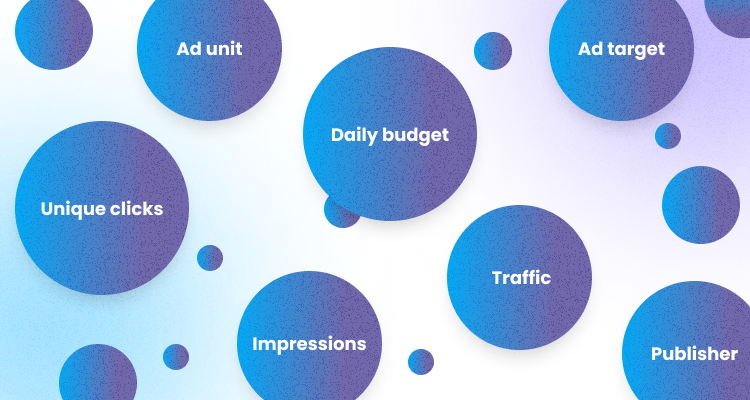

Just like all courses and subjects have terminologies, so does crypto marketing, knowing which will improve your results, whether you want to promote your project or monetize your traffic. These crypto marketing terms are similar to the general marketing terms. Let's have a look at the most popular: 

## 1. CLICKS

This metric counts the number of times website users click on an ad. 

Clicks can help you understand how well your ad is appealing to people who see it. Highly-targeted ads are more likely to receive clicks.

## 2. UNIQUE CLICKS

This is the total number of people that clicked on an advert for a period of 24 hours. For example, if someone clicks on an ad three times, the first click is counted as a unique click, while the other two are not counted as unique. 

## 3. IMPRESSIONS

This is sometimes called ad views. An impression is a metric used to quantify the number of digital views or engagements of a piece of content, usually an advertisement, digital post, or web page. One impression equals each occurrence of a web page, piece of content, or ad.

A good indicator of a working marketing campaign is tracking the number of impressions – a campaign with a low number of impressions will have a low conversion rate; this is a good indicator that strategies need to be evaluated.

## 4. UNIQUE IMPRESSIONS

A unique impression is the first time a user sees an ad within a 24-hour timespan. 

If a consumer notices your ad three times within 24 hours, the second and third impressions will not count as unique until the next 24 hours.

Unique impressions are vital because they can help marketing teams and publishers pinpoint the value of ad unit space and ad set. Unique impressions are one of the best ways to evaluate the eCPM or the effective cost per thousand ad impressions.

Unique impressions also let you know who is visiting your ads and how often, and this information can provide you with real insight into who exists within your target audience. 

## 5. TOTAL BUDGET & DAILY BUDGET

This is the Total amount an advertiser wants to spend on a campaign over a period of time. Sometimes this could span over weeks and months, depending on your selection. On our websites, we have features that help you set your ad's start date and end date, and the advert will run until the very end.

While daily, just as the name implies, means the budget expires in 24 hours. Advertisers set an amount for their campaign to run for a period of 24 hours; after 24 hours, the campaign will stop.

## 6. PUBLISHER

This is the owner of a domain name or a person that sells digital webpage space to an advertiser. They are also known as an ad publisher. There are different types of publishers: website owners, blog owners, podcast productions, mobile apps/games, and software platforms.

## 7. AD TARGET

This is a group of people or websites an advertiser would like to show an advert to. Ad target varies in different advertiser preferences, depending on demographics, psychographics, buying, and browsing behavior.

## 8. TRAFFIC

Traffic is a count of the number of visitors to a website or web page; the metric can be further defined by its source. An impression (also known as a view-through) is when a user sees an advertisement.

In practice, an impression occurs any time a user opens an app or website, and an advertisement is visible. It is not to be confused with an engagement. 

Not all traffic is good traffic. Sometimes people visit a webpage and leave, or “Exit,” soon after. While tracking website metrics, Account Managers also look at such things as the amount of time spent on a page and how many pages a user visits. 

It is done to understand whether that user engages with the content.

Pages that are more engaging convert more. 

## 9. AD UNIT

These are codes publishers integrate into apps and web pages to display ads to users to monetize their traffic.

There are many different kinds of ad units, including banner ads, interstitial ads, rewarded video ads, offerwall ads, and playable ads. Each ad unit looks and behaves differently. At A-ADS, we offer banner ads only.

## 10. BANNER ADVERTISING

Banner advertising refers to using a rectangular graphic display that stretches across the top, bottom, or sides of a web page to display ads to the webpage traffic. 

The banner advert can also be a text advert. At A-ADS, we have both features your advert can show as text and banner.

Banner ads are image-based rather than text-based, and this is one of the most popular forms of online advertising, which is perceived to be attractive and more engaging.

## SIMILAR TERMS COMPARISON

### IMPRESSIONS VS CLICKS

Impressions are the number of times your ad pops up before a potential customer, and clicks are counted when a customer clicks on that ad. This is all the difference between impressions and clicks.

With an impression, a user only sees an advertisement. An engagement, or a click, happens when a potential customer follows through and clicks on the ad. 

While engagements are ultimately more valuable, impressions are still an essential metric for online marketing.

### ENGAGEMENT VS. TRAFFIC

Engagement ads are a type of engagement that shows that someone interacts with your ad by either commenting, reacting, sharing, or carrying out an action. Before an engagement happens, there will be a presence of traffic. High webpage traffic leads to impressions, engagement, and clicks.