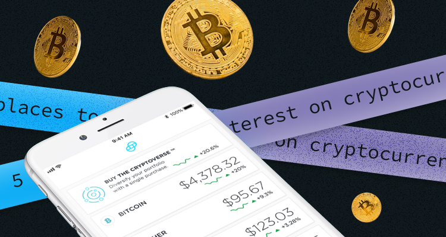

## Where to Earn Interest on Crypto

If you are a long-term investor, time plays into your hands. It also means that you should consider earning interest on your digital assets and receiving passive income. 

Many platforms offer interest-bearing accounts that pay you in crypto you fund your account with, and this interest varies from relatively low to high depending on what cryptocurrency you possess. This guide will look at some of the most trusted crypto interest accounts and learn how to earn interest on crypto. 

## Best Crypto Interest Accounts Reviewed

### 1. Aqru

First, Aqru supports bitcoin and ethereum, which attract an APY from 2.5 - 5%. For stablecoins, Aqru will pay even more - a very competitive APY of 8%. Plus, unlike other platforms, Aqru does not ask you to lock your crypto away but allows you to make all of its supported savings accounts flexible. It means that you can withdraw your currency from your Aqru account at any convenient time.

The second remarkable feature to mention is that Aqru distributes your interest daily so that you can track it daily.

And one more, Aqru allows you to deposit funds via crypto or fiat. If you currently own ethereum and wish to earn interest on your idle tokens, it's just a case of transferring ETH into Aqru. This process is no different than depositing into a crypto exchange.

As for the fees, you won't pay any for opening an account, maintenance or deposit. But Aqru will charge you $20 for a crypto withdrawal. 

One more thing that makes Aqru so convenient for users is its user-friendly interface. If you need to learn how to open an account and do the rest, don't worry! Their support team will help you via live chat or email if something goes wrong. All processes are described clearly and straightforwardly. 

### 2. DeFi Swap 

What about staking? At DeFi Swap, this process is very straightforward. Users have several options of lock-up terms to choose from – 30, 90, 180, and 365 days. And as everywhere else, the higher the lock-up period, the more interest you earn. DeFi Swap also supports yield farming services, which are offered on a decentralized basis via smart contracts. 

Two excellent features DeFi is currently working on are the integration of NFT swapping and staking tools into its platform and the mobile app. The company promises to release these two soon. For now, you can still access all instruments offered by DeFi Swap on your mobile.

As for the fees, DeFi Swap does not have fixed pricing like you will find on centralized exchanges. The automated market maker or AMM determines all prices. Specifically, your fees depend on how busy the underlying network is. In such a case, that's the Binance Smart Chain. But the good thing is that DeFi Swap doesn't charge any fee for deposits or withdrawals. 

### 3. Gemini

Gemini was launched in 2015 and is now considered on the list of the best cryptocurrency platforms for earning interest. It has over 70 cryptocurrencies available in over 60 countries and all U.S. states.

Gemini's trading minimum for any coin is the smallest amount of each coin that can be bought. Although Gemini does not advertise its offering as a traditional staking program, its "earn" features pay out interest on specific cryptocurrencies. Rates range as high as 8.05% APY. As for the fees, you'll be charged both convenience and transaction fees which do not depend on Gemini's online site or a mobile app.

Gemini offers two types of wallets: a cold one called Gemini Custody and the hot Gemini Wallet. Users won't be charged for putting money into their Gemini account unless they use a debit card. In this case, Gemini charges 3.49% of the total purchase amount.

The platform also offers a suite of products that make up a more cohesive ecosystem for traders and investors.

### 4. YouHodler

Why is YouHolder on our list today? First, YouHodler does not have any hidden fees, rollover fees, or any fees for the first three hours of trading. The other costs are pretty competitive with the rest of the market players. Another convenience is that YouHodler never locks funds on the platform, and withdrawals are incredibly fast. 

Secondly, the products that YouHolder offers are incredible: over 50 cryptocurrencies, fiat currencies, and stablecoins. If you open a savings account, you can earn up to 8.32% APR plus compounding interest on various cryptocurrencies and stablecoins. The interest is paid weekly and automatically deposited into the client's YouHodler wallet. By the way, the savings account is free of charge.

One more thing about YouHolder, worth mentioning is its learning opportunities. The help desk sections offer tutorial videos and articles that help you to learn more about the platform. Their customer service works 24/7, and speaks multi-languages. It is an incredible help for beginners. 

### 5. BlockFi

If you open an interest account, BlockFi offers you to earn between 3% and 8.6% compounding interest on your cryptocurrency holdings. The account has no hidden fees and no minimum balance requirement.

The interest rate varies depending on what cryptocurrency you hold in your wallet. For example, bitcoin (up to 2.5 BTC) is 6%, ethereum - 5.25%, litecoin: is 6.5%, USDC, GUSD, and BUSD: 8.6%. Interest is paid daily and is added to your account monthly, which means you'll earn interest on your interest each month. 

As for crypto withdrawals, BlockFi offers one crypto withdrawal and one stablecoin withdrawal per month. Next, you need to pay a fee for each withdrawal. 

To conclude, BlockFi will suit you well if you are a beginner investor looking for a personal or business account and are open to increased regulation in exchange for higher security.

**Some additional options**

We can't help but mention such giant companies as Crypto.com and Coinbase that also offer earning interest options: 

**Crypto.com**

Crypto.com offers more than 50 cryptocurrencies. It works both for desktop and mobile versions. To find the best rates at Crypto.com, you must own and stake at least 40,000 CRO - Crypto.com's native cryptocurrency. You can also earn mid-tier rates by staking at least 4,000 CRO. The returns may vary depending on factors such as duration, but the platform says they can be as high as 14.5%. 

**Coinbase**

Unlike other platforms on our list, Coinbase has a limited selection of coins that are eligible for staking and rewards on its central platform. But, users of the Coinbase wallet service have some additional options. Five assets are available on the leading platform, with rewards of up to 5.75%. On the wallet service, Coinbase offers 26 crypto assets, with rewards of up to 15%. Rewards payout rates depend on the asset you're staking, ranging from daily to quarterly.

## How to Earn Interest on Crypto

Now let’s talk about 4 simple steps to earn interest on cryptocurrency. 

### Step 1: Choose the platform you like and open a crypto account 

As you've learned from the information above, several platforms allow you to earn interest on crypto. Learn more about each of them, decide, and choose the platform that suits you best. Next, create an account.

### Step 2: Compare interest rates

Then, directly on the platform, compare the interest rates you can potentially earn from your crypto. Nearly all platforms have an interest calculator that can help you. Remember about the fee that the platform charges. Depending on the company, the fee may vary significantly. A reasonable interest rate on stablecoins is typically between 6% and 9%. Some companies offer pretty high-interest rates for stablecoins at 12% annual interest. Others may offer some unbelievable rates over 100%. But we would be skeptical about such significant figures because, pretty often, they are an indication of high crypto inflation rates and highly leveraged positions.

### Step 3: Buy the cryptocurrency you want and add it to your portfolio

As soon as you purchase cryptocurrency through one of the exchanges like Binance or Coinbase, you can send your funds to your crypto wallet address on the platform you seek to earn interest on.

### Step 4: Earn interest

You'll start earning interest when you've added funds to your interest-bearing account. There is nothing much left to do but wait. Sit back, relax and watch your crypto holdings grow. Earning interest in cryptocurrency is especially for those investors who believe the price of Bitcoin and other cryptos in the long term.  

## Conclusion 

If you are a long-term investor, consider earning interest on your digital assets and receiving passive income because it is easier than ever. With the right crypto staking platform, you can make double-digit interest rates and build a portfolio of cryptocurrencies that bring you a steady income.