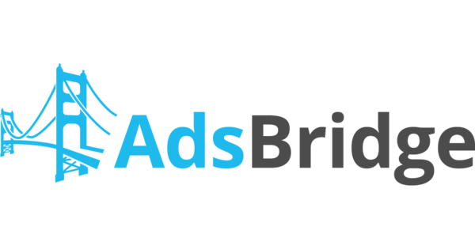
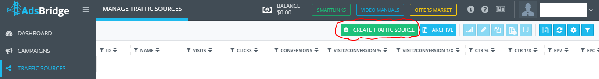
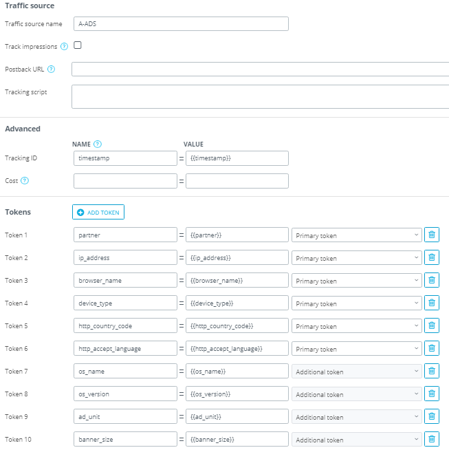
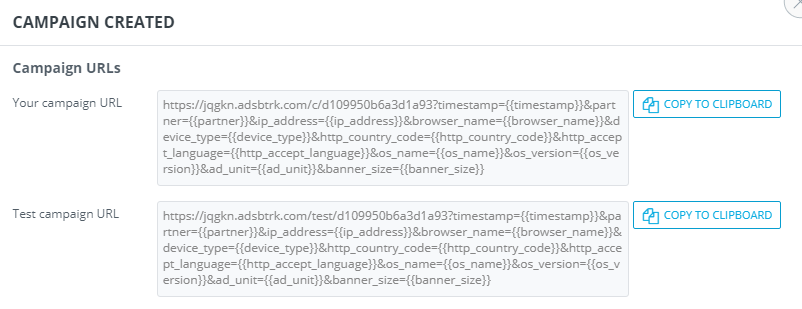
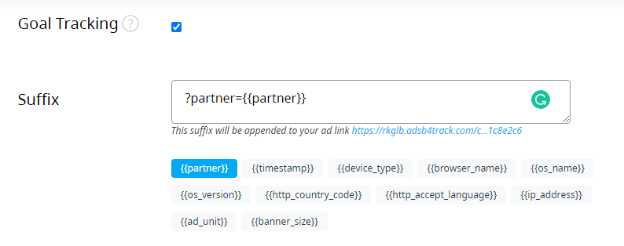
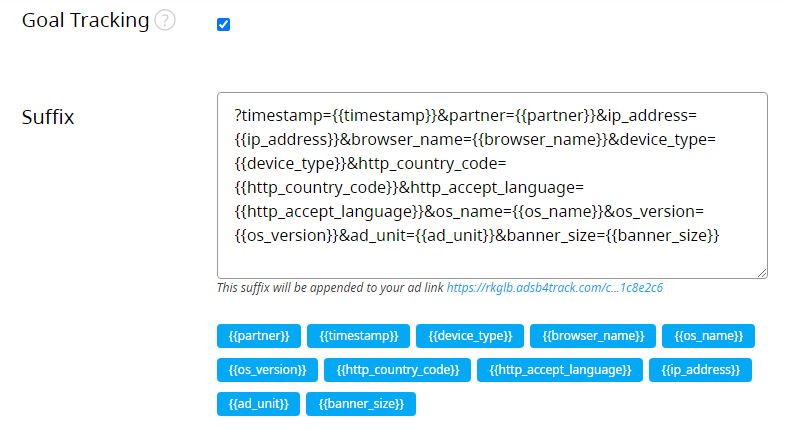
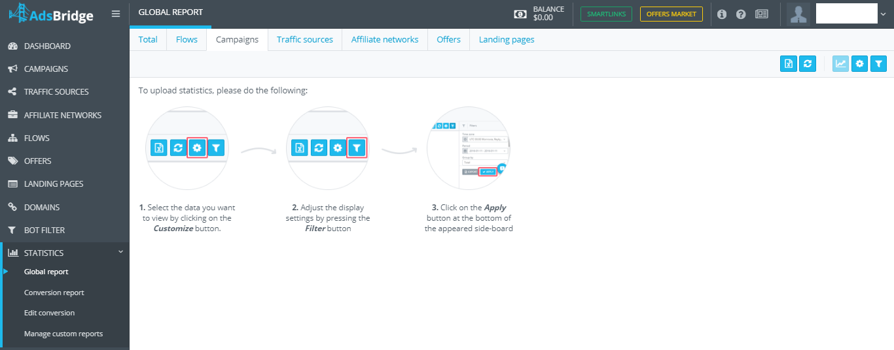
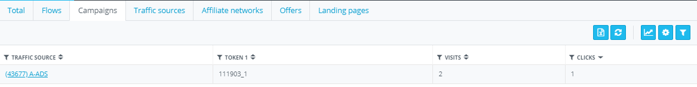

# in collaboration with

# What is AdsBridge?

[AdsBridge](https://www.adsbridge.com/) is a tracking solution built for affiliate marketers, media buyers, and marketing agencies. AdsBridge delivers a service for intelligent traffic monetization with complete access to some of the best optimization tools.

## Integration Instructions

**Prerequisites:**

* AdsBridge account
* A-ADS account
* A-ADS campaign with goal tracking enabled

**Let's begin!**

1. Create a traffic source in AdsBridge.

* Go to the Traffic sources tab.
* Click the “Create traffic source” button.

* Fill the form as shown below.

* You can change or adjust (if necessary) any option in the New traffic source form. Once you have done so, click the “Save” button. \
  Note: “{{partner}}” should remain in “token 1”.

2. Create an offer. Read the “Creating an Offer” article [here](https://www.adsbridge.com/guide/create-offer/), to learn how to do that.
3. (Optional) Create a Landing page. Watch how to create one [here](https://www.youtube.com/watch?v=7FLHUU1eyng).
4. Create a campaign in AdsBridge with your earlier created traffic source. If you don't know how to create a campaign in AdsBridge, find out [here](https://www.adsbridge.com/guide/create-campaign/).

**Note**: Use your AdsBridge campaign link as your A-ADS campaign link, without the “?” and everything after.

Also, if you did not create a landing page you can use AdsBridge “direct link”, as seen in the image below:

5. Log into your A-ADS account.
6. Enable Goal tracking for your campaign at A-ADS as seen in the image below, if you don't have a campaign you can create one [here](https://a-ads.com/campaigns/new).

7. Update your A-ADS campaign’s “Goal Tracking” “Suffix” with your AdsBridge’s campaign link, only everything after, and including the “?”, or simply by picking the necessary tokens below the place holder, they will be added to the “suffix”, then save your campaign.

8. You can check the statistics on campaign performance with three simple steps as seen below:

9. Statistics should look something like the image below, based on your settings:

Note: AdsBridge Statistics only show “Token 1 - Token 6”.

**All Done!**