# +

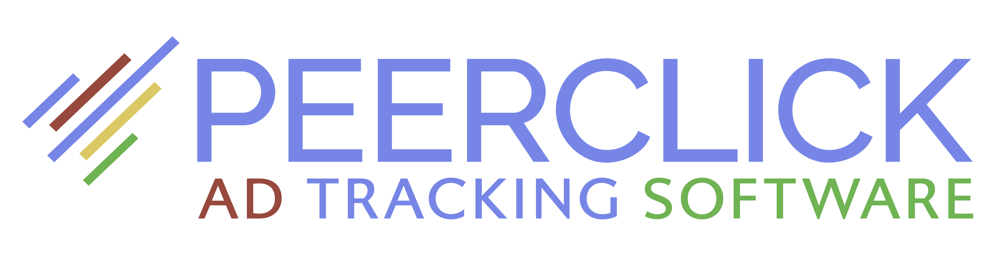

## What is PeerClick?

FREE AD  TRACKING SOFTWARE. To track, analyze, optimize, and scale online advertising campaigns and affiliate programs in real-time.

PeerClick offers an incredible life-time Free Plan which includes 100,000 clicks per month and has no time limits!.

Use Promo code "A-ADS" and get $50 on your balance!

[GET BONUS ](https://trk.peerclick.com/15GjdS?manager=vp&source=A-ADS&promo=A-ADS&language=en)

## Integration Instructions

**Prerequisites:**

* PeerClick account
* A-ADS account
* A-ADS campaign with goal tracking enabled

**Let's start!**

**1. Create a traffic source in PeerClick.**\
Go to the Sources tab.\
Click “create source” as seen in the image below:

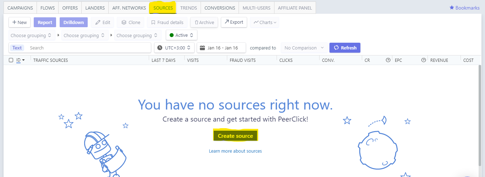

Search for the A-ADS template, then click add, as seen in the image below:

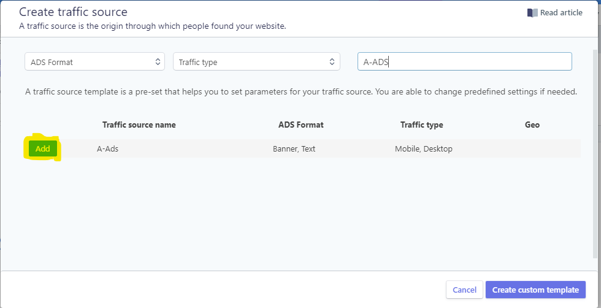

A setup form with all the details filled in will appear, just click “Create Traffic Source”, as seen in the image below.\
Note: There is no reason to change anything, except if you have different configurations in mind.

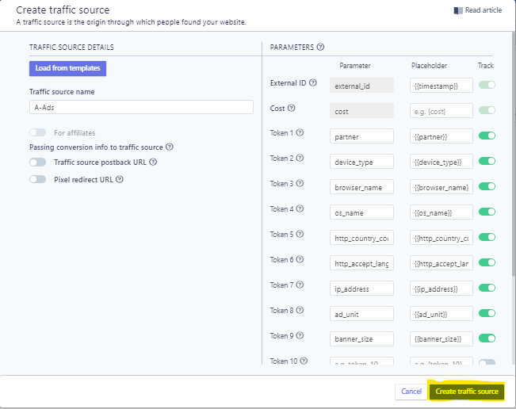

- - -

**2. Create an offer.**\
Go to the offers tab\
Click “Create offer”, as seen in the image below:

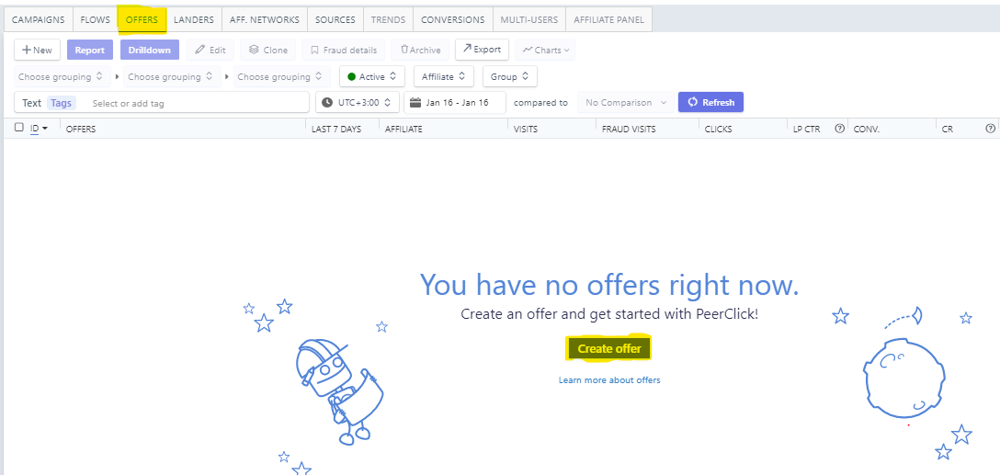

Configure your offer name and URL, then click “Create Offer”, as **seen in the image below**:

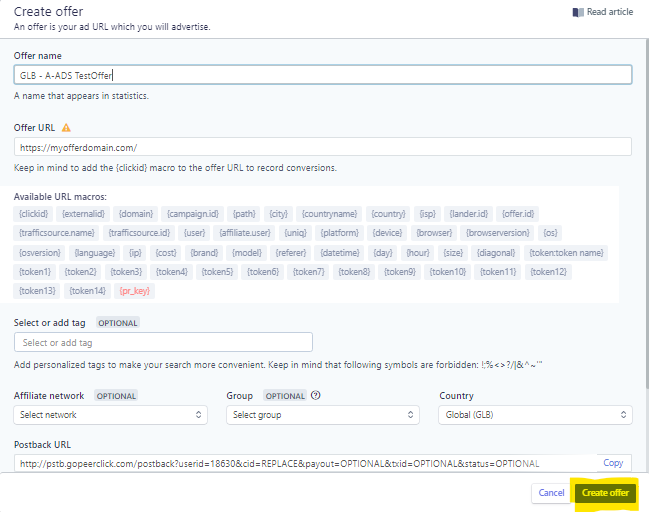

- - -

**3. Create a campaign at PeerClick.**\
Go to the “Campaigns” tab.\
Click “Create Campaign”, as seen in the image below:

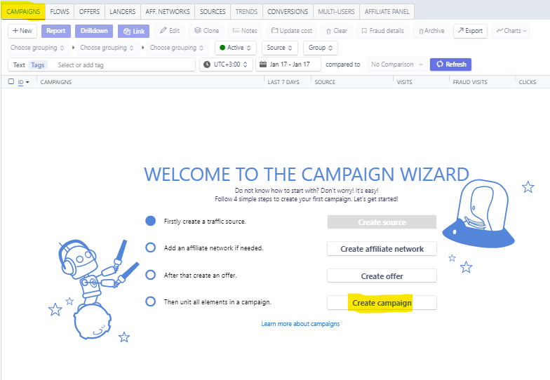

Configure “Campaign Name”, “Traffic source”, “Paths”, “Offers”, and enable “Direct Linking”.\
Click “Create”.\
Note: This is assuming you are not using a “landing page”, this setup would refer to the offer URL (the site you promote).\
Example in the image below:

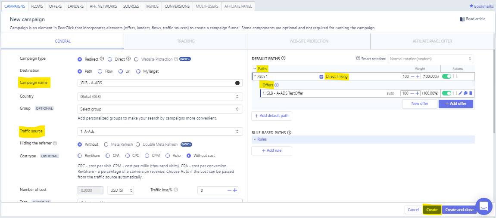

- - -

**4. Get the campaign tracking info.**\
Visit your newly created campaign “Tracking” tab then click “copy”, as seen in the image below.

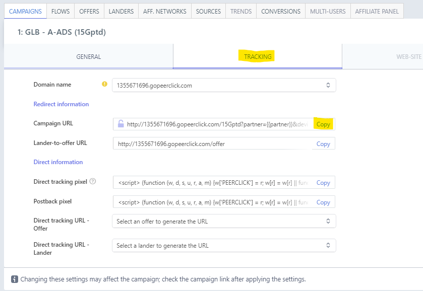

- - -

**5. Configure your A-ADS campaign.**\
Set your A-ADS campaign link to your PeerClick campaign URL without the “?” and everything after it.

For example: http://1355671696.gopeerclick.com/15Gptd

Then set your A-ADS campaign’s goal tracking suffix to the “?” and everything after.

For example:

```
“?partner={{partner}}&device_type={{device_type}}&browser_name={{browser_name}}&os_name={{os_name}}&http_country_code={{http_country_code}}&http_accept_language={{http_accept_language}}&ip_address={{ip_address}}&ad_unit={{ad_unit}}&banner_size={{banner_size}}&external_id={{timestamp}}?partner={{partner}}&device_type={{device_type}}&browser_name={{browser_name}}&os_name={{os_name}}&http_country_code={{http_country_code}}&http_accept_language={{http_accept_language}}&ip_address={{ip_address}}&ad_unit={{ad_unit}}&banner_size={{banner_size}}&external_id={{timestamp}}&os_version={{os_version}}”
```

As seen in the image below:

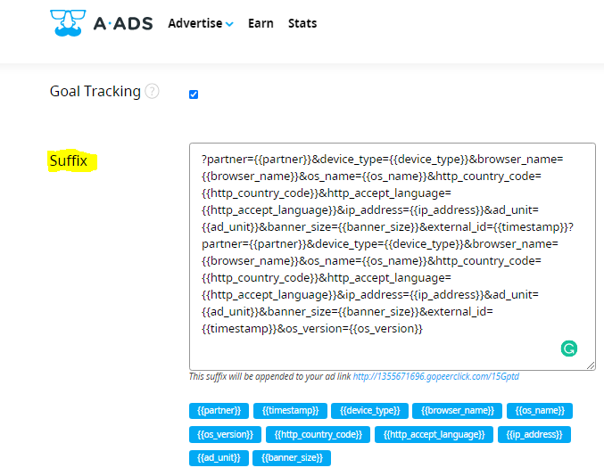

**6. Checking Reports.**\
In PeerClick’s campaign tab, click preferred campaign, then click “Report”, as seen in the image below.

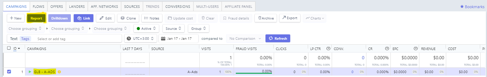

The highlighted row in the image below can be used to see more info in the report.

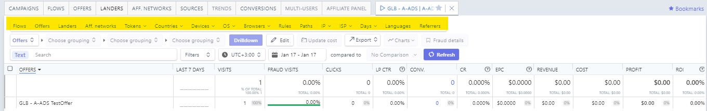

**All Done.**