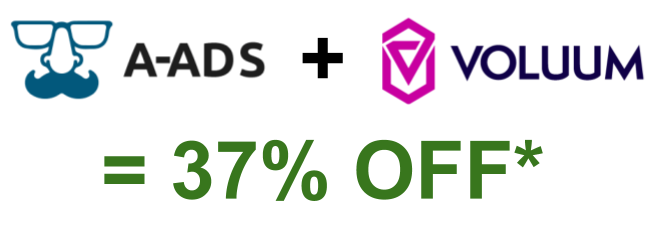
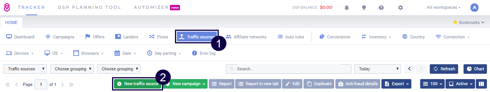
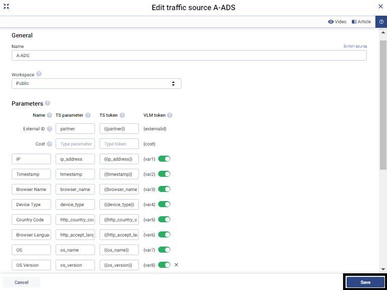
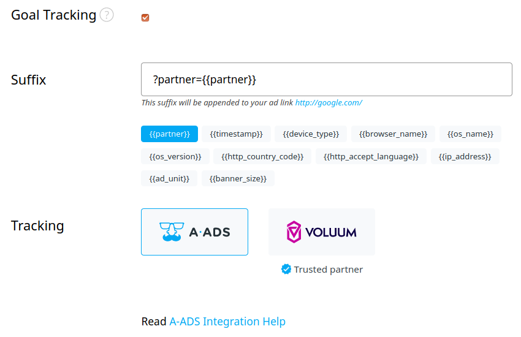
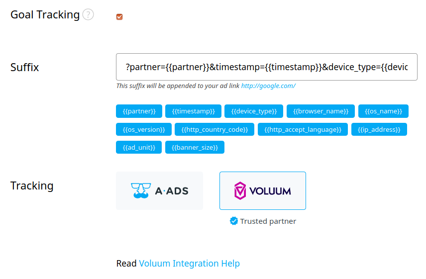

[Voluum](https://voluum.com/partner/a-ads/) is an innovative, real-time analytics platform for tracking online campaigns. The system designed by Codewise is for the use of performance marketers and individual advertisers who want to monitor the progress and profitability of their campaigns.



\* Voluum offers up to 37% discounts to A-ADS users, claim your discounts [here](https://voluum.com/partner/a-ads/). Track, manage, and optimize all your advertising campaigns in one place. Explore the powerful features and skyrocket your performance. 

See also [our article about Goal tracking](https://a-ads.com/blog/2019-10-16-why-do-i-need-goal-tracking-how-to-switch-it-on/).

# Integration Instructions

## Prerequisites:

* Voluum account
* A-ADS account
* A-ADS campaign with goal tracking enabled

## Let's start!

1. Create a traffic source (TS) element in Voluum. Voluum provides you with the A-ADS traffic source template, so you can use it and skip most of the manual setup. To use this template, perform the following steps:

   * Go to the Traffic sources tab.
     Click the New traffic source button.
     
   * Select the A-ADS template from the list of available templates.
   * Click the Next button. The New traffic source form will appear.
   * You can change or adjust (if necessary) any option in the New traffic     source form. Once you are done, click the Save button.



2. Create an offer element. Read the Creating an Offer Element article [here](https://doc.voluum.com/en/adding_offer.html), to learn how to do that.
3. (Optionally) Create a lander element. Read the Create a Lander Element article [here](https://doc.voluum.com/en/adding_simple_lander.html), to learn more.
4. Create a campaign in Voluum with your earlier created traffic source element. If you don't know how to create a campaign in Voluum, find out [here](https://doc.voluum.com/en/create_simple_campaign.html).
5. Log into your A-ADS account.
6. Enable Goal tracking for your campaign at A-ADS as seen in the image below, if you don't have a campaign you can create one [here](https://a-ads.com/campaigns/new).



You'll probably want to use the `partner` parameter to track the traffic source that brought a visitor to your site, and you can also use more parameters available for tracking. You can add them too.



Please note, each parameter/token in the "A-ADS Suffix" represents "Voluum's TS parameter/token", e.g.:

```
A-ADS's goal tracking (GT)          Voluum's traffic source (TS)

partner={{partner}}                 TS parameter = partner, TS token = {{partner}}
```

Suffix parameters/token in A-ADS and TS parameters/token in Voluum are correlated. 

7. If you use redirect tracking, please, set your campaign URL as your Voluum campaign URL, remove the "?", and everything after.

All done!