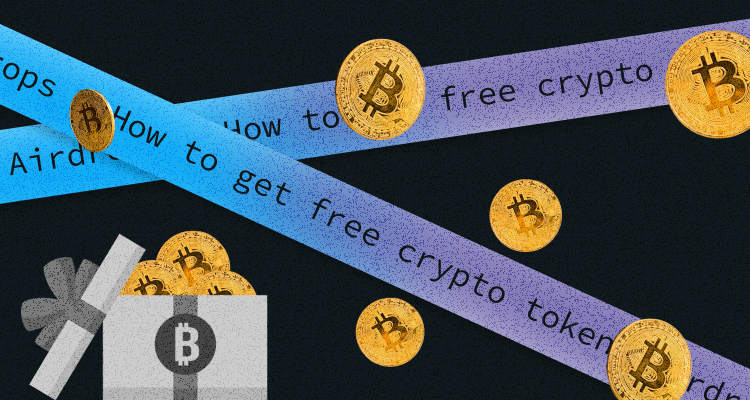
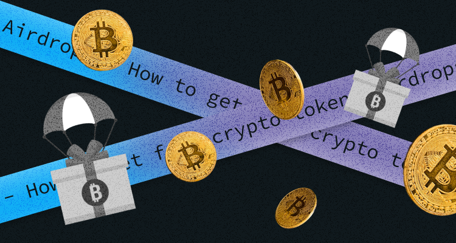

## What Is a Crypto Airdrop?

Have you ever received a discount card encouraging you to buy some stuff? Airdrops are the same as these cards: they tell you about the project, motivate you to learn more, and hope that the recipient will buy something in the future. 

You may say that airdrops are a part of a marketing campaign when blockchain projects or developers send some free tokens to their potential clients. 

To get these free tokens, users often need to perform some tasks, such as following an account, tweeting, sharing posts, or signing up to receive updates. 

There are plenty of airdrops, and each crypto project has its requirements. Some are done directly into users' wallets, while others require a manual claim. But most airdrops share the same goal: to increase awareness and overall interest in the project. 

This article will tell how airdrops work, how to get some free crypto tokens, and how to find unclaimed airdrops. Without further ado, let's start!

## How do crypto airdrops work

Let's look at how airdrops work and what types you can face. Airdrops usually consist of a small amount of cryptocurrency distributed to several wallets (usually on Ethereum or Binance Smart Chain). 

Not so often, but still, several projects give away NFTs instead of regular crypto. Also, some projects distribute crypto without even asking to complete any tasks. In contrast, others try to motivate users to participate in sharing posts or do other stuff to promote a project. 

Sometimes, the airdrops can be sent only to wallets that collaborated with the project before a specific date. For example, 1INCH and Uniswap provide the most popular airdrops of this kind. 

Now let's see some other types of airdrops with their unique characteristics. The main aim of any airdrops is marketing, so projects want to grow brand awareness and user attraction in exchange for rewards. 

So common types are: 

**Standard airdrop**

Characteristics: 

* A super popular type of airdrop
* Tokens are given for free without any particular actions
* Users need to create an account and provide their wallet address
* The amount of tokens is usually limited  

**Bounty airdrop**

Characteristics: 

* Users need to complete specific tasks, such as sharing a post or tagging friends 
* Quite popular among new projects 
* Users have to spend their energy and time to get the tokens

**Holder airdrop**

Characteristics:

* Users can receive crypto tokens if they already keep a certain number of tokens of another cryptocurrency
* The amount of your airdrop is determined based on a snapshot that often has a specific date or period. If the wallet balance meets the minimum requirement, recipients can claim free tokens according to their holdings at the time of the snapshot
* Users receive the amount of crypto based on the number of tokens in their wallets. 

**Exclusive airdrop** 

Characteristics: 

* This airdrop sends crypto only to designated wallets
* Usually, the receivers need to be familiar with the projects, like being an active member of a community or a supporter 

## How can you get free crypto tokens

As I mentioned above, every airdrop has individual features, but most of them are easy to find. So, there are some steps to take if you want to participate in an airdrop:  

Step 1: Find relevant crypto airdrop websites

Step 2: Check social media for the #airdrop hashtag and see if anything new has happened

Step 3: Become an active user of different cryptocurrency services, products, platforms, and blockchains

Step 4: Explore cryptocurrency-related forums and news portals 

Step 5: Set up a crypto wallet and make a deposit

You can't receive or claim an airdrop if you don't have a wallet address. Using an exchange address is convenient but not suitable for airdrops. 

What are the best crypto airdrops? 

There are a wide variety of free crypto airdrops, but I will mention several worth considering: 

**Tamadoge** 

This project has a [Telegram page](https://t.me/TamadogeOfficial) you can visit. Tamadoge is giving away $100,000 to one holder of $100+ of their token, TAMA.

**Battle Infinity** 

Buttle infinity is a new metaverse game. They give away $3000 in IBAT crypto tokens and, in return, want a user to complete some simple tasks like following the project's social media. All future crypto airdrops by Battle Infinity are usually announced on their [Telegram page.](https://t.me/battleinfinity)

**Lucky Block**

Another crypto game based on blockchain technology. Lucky Block is one of the most popular crypto airdrops for 2022. The platform quite regularly announces new crypto airdrops, and users can register with the platform not to miss their chance. 

**Pulsechain** 

This one is considered one of the best airdrops in terms of effort and value. Pulsechain tokens will be given to everybody with ETH in their wallet in a 1:1 ratio. Users have 30 days to relocate tokens to a new wallet; otherwise, they can lose their airdrop.  

**Binance** 

This world-known crypto exchange often provides instant crypto airdrops. Binance often hosts several trading tournaments and giveaways for its users. Their promotions include a share of 90,000 BUSD, 200 NFT mystery boxes, and a prize pool worth $4,000. All you need to do not to miss your chance is follow their newsletters.

## Are crypto airdrops safe?

Unfortunately, not always. There are many cases when fraudulent airdrops stole users' wallet funds while claiming or transferring the free tokens. To avoid such nasty things, do some research and confirm the project's legitimacy before claiming an airdrop. Be especially careful when someone asks you to connect your wallet to an airdrop website.

Often fraud happens when some projects do the distribution without asking for anything. Others may ask you to perform specific tasks before even claiming. These tasks often include following social media accounts, subscribing to a newsletter, or holding a minimum amount of coins in your wallet. But there is no guarantee that you will get the airdropped tokens, especially when the promised amounts are too good to be true. 

And remember that it is not wise to connect your crypto wallet to an untrustworthy party or give up your private key.

## Are crypto airdrop and ICO the same thing?

They may seem the same, but crypto airdrops and ICOs are different concepts. The main thing that distinguishes them is that airdrops don't require any investment from participants, while ICO is a crowdfunding method. However, they both involve new cryptocurrency projects.

## Conclusion 

In general, crypto airdrops can be helpful for crypto projects to attract attention and get new users. It can also be a good way for crypto enthusiasts to grow their portfolios with unique tokens. But it would be best if you were careful with airdrops as there are a lot of scammers around. Be careful and do your research before participating in any airdrop.