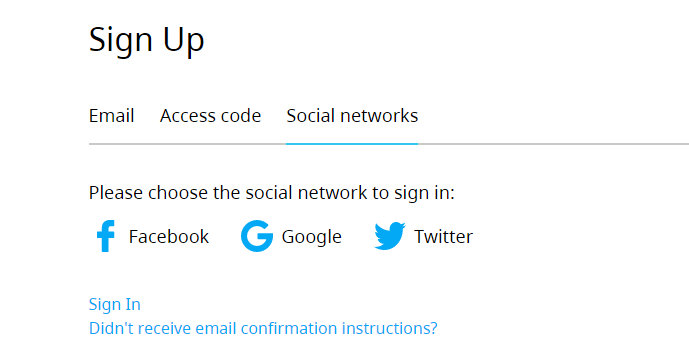
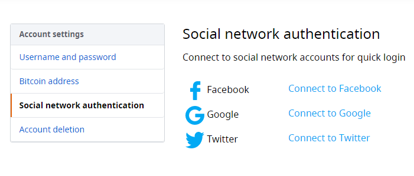

To improve the experience of our users, we have implemented authentication via social networks.

Now you can [sign in](https://a-ads.com/user/sign_in#!social-networks) or [sign up](https://a-ads.com/user/sign_up#!social-networks) with Twitter, Facebook, and Google.

Or you can link your social network accounts to your existing A-ADS account in the User - Settings - Social networks authentication [page](https://a-ads.com/user/social_networks).

A-ADS receives the minimum amount of personal data from your social network account and records only your email address. We use it for access recovery, security confirmations, and other relevant notifications. If your social network account has the same email address as your existing A-ADS account, then it will be linked to it automatically.

If you sign up with your social network account that does not have an email address, then we will ask you to specify it. Your account will be activated after your email is confirmed.

We have developed this feature for the convenience of our users, and we hope that you enjoy it, but you can still create [anonymous accounts](https://a-ads.com/blog/2020-04-08-important-changes-for-unregistered-users/) if you like.