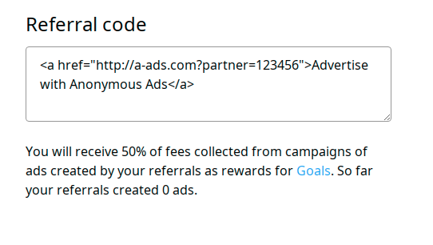

If you invite others to advertise with A-ADS, you can count on 10% of money spent by them. When somebody follows your partner link, we use a cookie to track his activity. An advertiser is considered your referral for 6 months after he creates a campaign or a user account via your link. Our payouts are transparent and you can see them here: <https://a-ads.com/campaigns/1/goals>

You can create an affiliate ad unit here: <https://a-ads.com/ad_units/new>

Actually ad units of "site" and "app" types can work as affiliate ones too. An affiliate link is generated automatically for any ad unit, it can be found in the bottom right corner of an ad unit page. 

And our affiliate ad displayed on your site works as an affiliate link by default.

