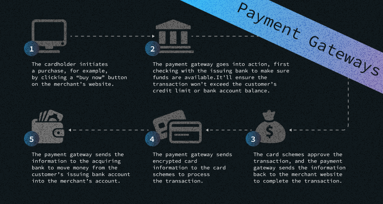

When running your own online business or a project, you need to accept credit card payments on your website. That's when you need a payment gateway. You use it regularly as a client. But if you want to know more about how this technology works for crypto payments, this article explores the ins and outs of payment gateways and how to get one set up for your business.

## What Is A Payment Gateway And How Does It Work?

First, let's get to the basics of the gateway payment mechanism. In a nutshell, this is the mechanism that reads and transfers payment information from a customer to a merchant's bank account. It captures the data, ensures that funds are available, and then pays the merchant. 

Online payment works the same. The main difference is that a payment gateway is cloud-based software that connects the seller and the customer. When you pay in an offline shop, this software is built into a point-of-sale (POS) system or card reader that processes a transaction when the cardholder pays by card. The payment process includes stakeholders such as a seller, customer (a cardholder), issuing bank, credit card companies that manage the card (like Visa and Mastercard), and an acquiring bank that holds the merchant's account.

Let's look at the graph that helps to understand the process better: 

## **Why Customers Want To Pay With Crypto**

I want to show you some exciting statistics first. According to the PYMNTS survey conducted in May, almost one-third (30%) of crypto owners said they had bought something online using their digital assets. While more than one-fifth (21%) of holders made an in-store purchase using crypto. At the same time, one-quarter of crypto owners said they would choose sellers that accept crypto. 

And not only have customers experienced the convenience of crypto payments, but such red-taped organisations like banks also see crypto payments' potential. Thus, Visa has more than 30 crypto card programs, and Mastercard has more than 20. 

### Reason 1 - Better Security 

Cryptocurrency is considered more secure than credit and debit card payments, especially after the pandemic when credit and debit cards were the sources of the majority of fraud reports among all payment methods. Plus, the blockchain general ledger verifies and records every transaction, making it nearly impossible to steal someone's identity. Crypto, in turn, does not need third-party verification, and when a customer pays with cryptocurrency, their data isn't stored in a centralised hub. And these hubs are very often a source of breaches.

### Reason 2 - Irreversibility 

Cryptocurrency transactions are irreversible, which helps business owners better manage their cash flow. But, if someone requires a refund, the retailer must manually pay them back.

### Reason 3 - Low Fees

Probably, the most popular reason is the fee. Just compare PayPal charges around 4% per transaction, which is a rip-off. At the same time, Cryptocurrencies charge much lower fees, if any. Plus, if your business works worldwide, cryptocurrencies can help avoid international currency payment fees, which is incredible. 

## **Best Bitcoin Gateways Of This Year**

If you want a payment gateway for your business, it's wise to choose a highly secure and beneficial platform and pick up the best one. So, which is the best?

### 1. BitPay

Let's start with [BitPay](https://bitpay.com). This is an easy and simple payment gateway to set up and operate. The whole process has been created to make it as straightforward as possible to concentrate more on business than tech innovations. 

BitPay has two useful features for sellers. Firstly, you can set withdrawal transaction speeds to a necessary time frame. This feature is handy if you prefer withdrawals to occur at set intervals. The second feature is the two-factor authentication that helps make accounts even more secure.

This bitcoin payment gateway offers a free cap of $1,000 worth of daily transactions and $10,000 in annual transactions. If more transactions are done, it levies a 1% transaction fee. The only disadvantage of this gateway is that it supports direct bank deposits only in 38 countries.

### 2. Coinbase 

Coinbase is one of the largest cryptocurrency exchanges, but it also offers crypto payment gateway services through Coinbase Commerce. This gateway is fast and allows merchants to receive payments securely. 

Coinbase works in 100 countries. Its payment methods are bank accounts, deposits, debit cards, credit cards, and PayPal. Impressive, right? Moreover, Coinbase offers some integrated services for Shopify, WooCommerce, Magento, and OpenCart. It works not only with Bitcoin but supports a variety of cryptocurrencies such as Ethereum, Bitcoin Cash, Litecoin, Dogecoin, USD Coin, and DAI. 

The exchange offers such service for free on the first $1 million of transactions but after levies a merchant fee of 1%.

### 3. Coingate 

Another good solution is [Coingate](https://coingate.com). This gateway allows merchants to accept even traditional currency payments like USD and Euros. This gateway is super user-friendly and will enable merchants to set up and monitor payments from their phones, making the process convenient. 

Coingate supports 40 other cryptocurrencies apart from Bitcoin and offers a range of various plugins. These plugins help users to create bitcoin payment buttons on any website. 

As for the fees, Coingate charges around 1% on all transactions, which usually take about 1 hour.

### 4. CoinsBank 

This [user-friendly gateway](https://coinsbank.com) has a beautiful reputation and apps for Android and iOS. This great bitcoin gateway supports most major fiat currencies, including USD, GBP, and EUR.

As for more bonuses, Coinsbank allows for the free transfer of currency to family and friends 24/7. Plus, the platform offers the latest security, including a two-factor authentication system and a 24-hour customer support system to help users to solve their problems instantly. 

### 5. Shopify 

Probably everyone has heard about this brand. [Shopify](https://www.shopify.com) is one of the world's most trusted and best cryptocurrency payment gateways. It is already used by 1,000's businesses worldwide to accept payments in bitcoin and other cryptocurrencies. 

The platform is packed with heaps of good features, including APIs that allow integrations with Coinbase and other payment gateways that help make payment processing as easy and transparent as possible.

What about the drawbacks? Well, they occur as usual. Shopify wants merchants to use the payment processing facility to sign up for a Shopify merchant account. Transaction fees vary depending on which payment processor a merchant chooses.

### 6. AlfaCoins 

The last on our list, but not the least important. [AlfaCoins](https://www.alfacoins.com) offers an opportunity to split payments between fiat and cryptocurrency. If merchants want to retain some bitcoin from each transaction to cash in on surging prices, this is an excellent option, as it allows them to hedge their bets without taking a significant risk. 

The transaction fee is also relatively low, at only 0.99%. But, AlfaCoins doesn't offer the $1 million worth of free transactions that Coinbase does. One more advantage is that AlfaCoins works worldwide, except for Iran and North Korea.  

AlfaCoin supports major cryptocurrencies, including Bitcoin, Bitcoin Cash, Dash, Litecoin, Ethereum, Tether ERC-20, and XRP. You also can withdraw the funds in USD or Euro. 

## **Pros And Cons Of Crypto Payment Gateways**

I have mentioned the significant advantages of implementing crypto gateways for your business, such as security and low transaction fees. Now I also want to mention some drawbacks of using crypto gateways. They are:

* **Again Irreversibility**

Yes, business owners will better manage their cash flow with a crypto gateway. But, if someone requires a refund, the retailer must manually pay them back. If you have a ton of refunds during the holiday season, your team will need to divert time and attention toward returning payments individually. It forces your team to keep immaculate records and creates inefficiency in your business operations and lots of additional work for your employees. 

* **Tax** 

In many countries, cryptocurrency is tax regulated. So, if you accept cryptocurrency, you must report it as gross income based on its fair market value when it was received. That also means you should study the cryptocurrency tax regulations of your country thoroughly.

* **This Method Is Still Risky**

Governments still can't manipulate the value of cryptocurrencies, which is both a risk and a benefit. On the one hand, cryptocurrencies are a hedge against monetary inflation. But the value of popular crypto is exceptionally volatile, and for many business owners, that risk level makes cryptocurrency unattractive. 

#### **Conclusion** 

It's always great to have a choice. Even if now using a cryptocurrency payment gateway isn't a must-have, you can still consider this solution's pros and cons. Check out the characteristics of top cryptocurrency payment gateways to know which one suits your business best.