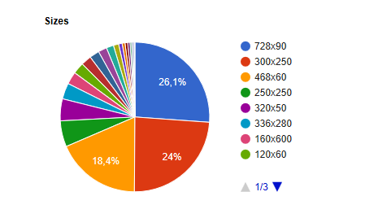
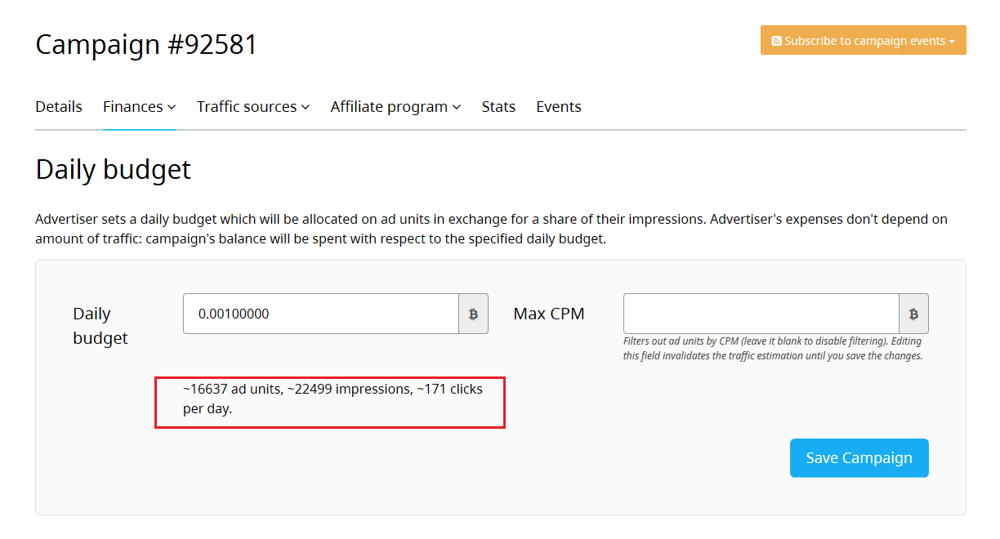

Yes, you can. To do that, you need to enable the "show banners only" option. At the campaign web page the checkbox "Show banners only":

 only")

You should add as many banner sizes as possible before doing this. At the time of writing this article the most popular sizes were the following: 

You need at least 728x90, 300x250 and 468x60 sizes as they cover ~68% of traffic.

Mind that if you have a banner and a text ad for one ad unit size, banner will be shown by default. If you enable the "show banners only" option, all the adaptive ad units become unavailable, despite matching your banner sizes. So, the amount of traffic that you receive decreases. And if you have all or nearly all banner sizes you probably don't need the "show banners only" option.

After enabling the option, please, check your estimated daily performance at your Budget page: the quantity of traffic will decrease and the campaign might become less efficient. Take care!

