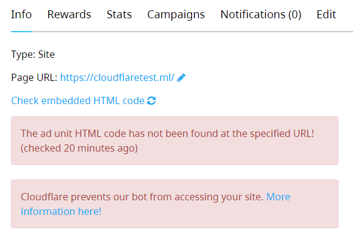

If you are experiencing the “Cloudflare prevents our bot from accessing your site” error as seen in the image below.

It means that for some security reason Cloudflare is preventing our bots from accessing your site.

In order to eliminate this error, follow these steps below.

1. Login to your Cloudflare account.
2. Select the specified domain.
3. Navigate to Security >> WAF >> Tools as seen in the image below.

4. Under “IP Access Rules”, add the IP addresses that you received from A-ADS support team.

Note : If you don’t have any of our bots IP’s, please contact our support.

5. Click “Check embedded HTML code” in your ad unit’s dashboard as seen in the image below.

6. Wait a few minutes, reload the ad unit dashboard, the results should be like below.

7. All done.