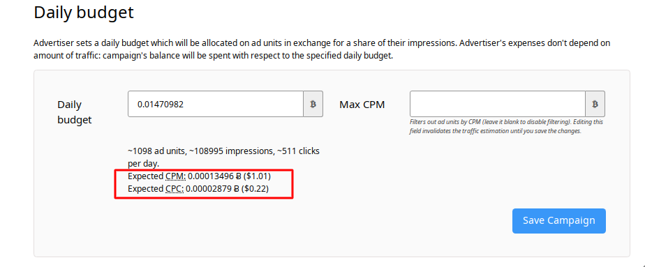

To make our advertisers' lives easier, we've recently implemented an interface amendment: now CPM and CPC estimations for an advertising campaign are visible on a "Campaign -> Payment model" page. So you don't need to count them manually each time you start a campaign or adjust it.

The number becomes red if CPC or CPM is more than $ 5. If the number of expected impressions is less than 1000, CPM is unavailable. If the expected number of clicks is less than two, CPC is unavailable too.

Please, check the "Campaign -> Payment model" page before you start your campaign and after you make any changes to it! The numbers will help you.

Still, A-ADS is not a pay per impression network, and you pay not a fixed CPM but [a daily budget for a share of targeted traffic](https://a-ads.com/blog/2019-08-11-how-does-daily-budget-work/). The numbers you see in the interface are estimative, although usually rather precise. If you want actual numbers, please, check how to do it [here](https://a-ads.com/blog/2019-08-19-what-is-cpm-for-my-campaign/).