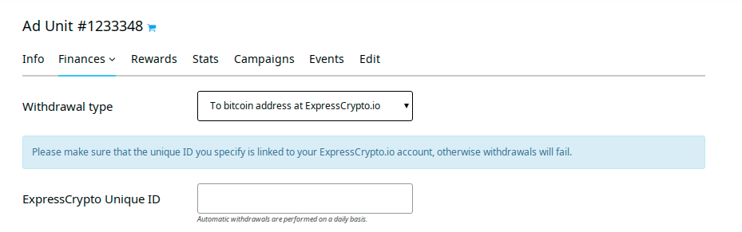

Since [FaucetHub](https://faucethub.io/) stops maintaining its services, we've replaced it with an alternative service - [ExpressCrypto](https://expresscrypto.io/). Thus our publishers keep the opportunity to withdraw little sums of money.

If you used FaucetHub, please, set new withdrawal settings. You can enable ExpressCrypto withdrawals in your user or ad unit withdrawal settings. 

You'll need to sign up at ExpressCrypto and specify your unique ID provided by this service in the corresponding field.

You won't face any withdrawal threshold to withdraw from A-ADS as ExpressCrypto allows 1-satoshi transactions. The withdrawal fee for any withdrawals from ExpressCrypto to bitcoin addresses is fixed and counts 500 satoshis, and there's no withdrawal threshold.

We believe that ExpressCrypto is a legit service, but we can't guarantee the safety of the funds sent to them. Please use it at your own risk!