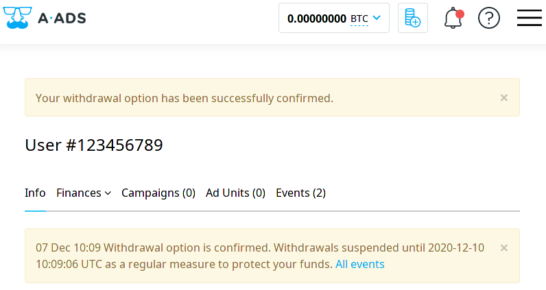
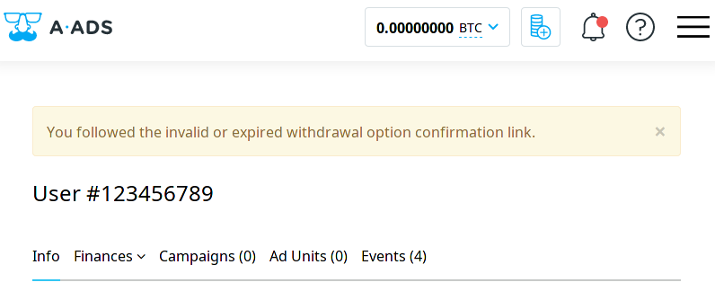

To keep our users’ money safe, we have recently implemented additional security measures. Now we require an email confirmation of a new withdrawal address. This feature works for non-anonymous accounts only - those are the accounts with verified emails.
 
If you specified an email during registration or added and confirmed it later, your email address is verified, and your account is safer than those without verified emails. Now we can send you notifications, confirmation letters, etc. Rest assured, we only send solicited emails.
 
If someone changes your withdrawal address, we will freeze the withdrawals until you confirm the new address via email. If it were not you who changed the address, then you would have a better chance to prevent the loss of your funds.
 
To confirm the new address, you need to click the confirmation link we send to your email. The link is valid for 24 hours. If you succeed, you will see the message: 
 
 
 

 
If you click and see the message that your link is invalid, this means that confirmation failed, and you need to request a new link to your email.
 

 
If you change your withdrawal address but do not receive the confirmation email, you should check the spam folder. If you do not see the letter in spam either, please, request a new one. You can request a new confirmation email in 15 minutes after the first attempt.
 
If you do not receive the second email either, please, contact our support - we will help you.
 
These changes do not refer to anonymous profiles. If you own one, your withdrawal settings are guarded only by the three days withdrawal cooldown.
 
