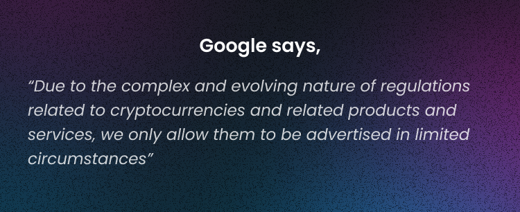
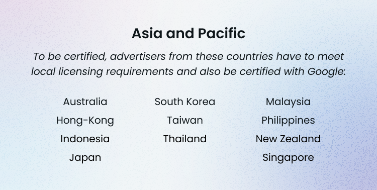
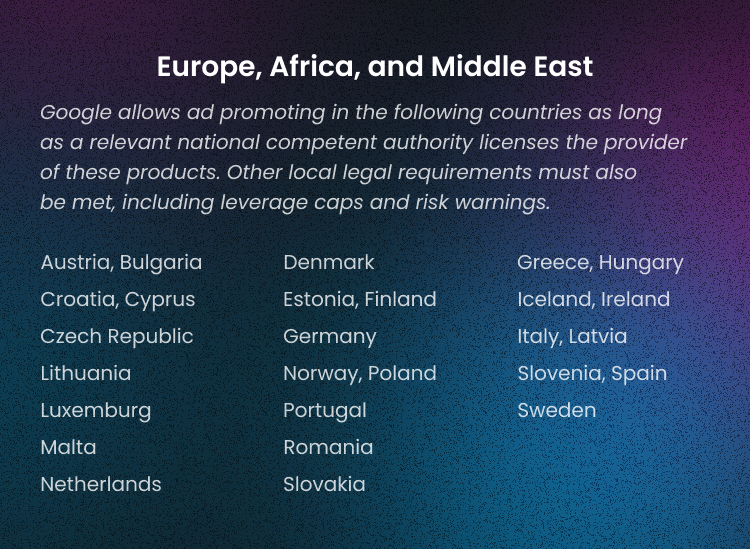
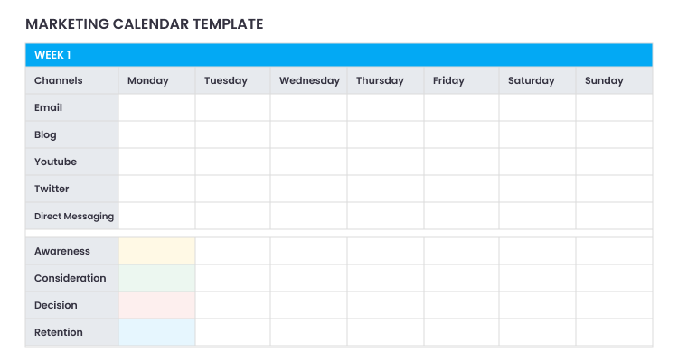

Running bitcoin ads, or ads of cryptocurrencies, exchanges, and crypto wallets, is often challenging as Google often bans crypto products. Their platform requires you to follow the policies and rules. Moreover, certain countries and companies' restrictions worldwide make running Google Ads tough but still possible. 

This article will check the Google Ads restrictions, find what bitcoin ads can be advertised, and see how you can promote your crypto project using Google Ads campaigns.

## What Cryptocurrency Can Be Advertised on Google

Unfortunately, not all cryptocurrencies can be advertised with Google Ads. Google has pretty strict regulations trying to avoid scams and frauds.

If you want to advertise your crypto project with Google, according to its policy, only the following is allowed now:

* Businesses that accept payment in cryptocurrency
* Crypto mining hardware
* Tax and legal services
* Services of security needs 
* Blockchain platforms
* Educational platforms

If you want to advertise a crypto wallet, you can still do it as long as the advertiser is a licensed provider. In addition to that, you need to check the local laws and industry standards.

## What Crypto Ads Does Google Not Allow?

Google has a list of crypto projects that can't be advertised. Under restriction policy falls the following: 

1. Ads for ICOs
2. DeFi trading protocols 
3. Crypto trading signals
4. Crypto investment advice 
5. Broker reviews and advice 

### Google Ads’ New Cryptocurrency Policies

Plus, from August 3rd, 2021, Google Ads account managers for cryptocurrency wallets will now be able to run PPC ads on the platform. This policy only applies to cryptocurrency wallets based in the US, although PPC managers can run Google Ads cryptos campaigns in any location worldwide.

As for the cryptocurrency exchanges, they must be correctly registered with either:

* FinCEN is a Money Services Business with at least one state as a money transmitter
* Or a federal or state-chartered bank entity

### Requirements For Crypto Banner Ad To Run Google Ads Campaign

To run a crypto campaign with Google or YouTube in a specific region, you must check the licensing requirements in those countries or areas where certification is currently available. 

As for the cryptocurrency exchanges, they must be correctly registered with either:

* FinCEN is a Money Services Business with at least one state as a money transmitter
* Or a federal or state-chartered bank entity

If your crypto project meets all criteria, you can apply for the certification [here.](https://support.google.com/adspolicy/answer/7645254)

## **How To Advertise Cryptos With Google Ads**

After you have checked the criteria and google ads requirements, your next step is to optimize all your ads, so they perform well. To do that, follow two easy steps:

1. **Optimize the keyword and negativizing keywords**

Only new, relevant, and popular keywords are suitable for your ad campaign. When targeting the audience, ensure you use the right keywords in the right ad group. Your crypto exchange or wallet may only suit some, so target the group interested in your crypto product. 

Adding negative keywords help you to save the budget and avoid splashing it on targeting people who aren't interested in your product or services. 

2. **Create high-quality ads** 

In a competitive crypto world, quality ads help your project stand out and bring it to the top positions in Google's search results. Pay attention to the Quality Score that helps you to check how good your ads are.

In short, Quality Score estimates the quality of your ads and the landing pages triggered by them. To learn more about Quality Score, check this [page](https://support.google.com/google-ads/answer/6167118?hl=en) by Google Ads. 

And one more, before launching an advertising campaign for a crypto project, first, make sure you have a marketing strategy because the needs and goals of your project will determine the type of paid-for advertising the project should choose to invest in.

Google Ads are one of many ways to advertise your crypto business. A-ADS provides advertising services for crypto companies bringing publishers and advertisers from all over the world together. [Check our page](https://a-ads.com/) and run your first ad campaign in 3 easy steps.