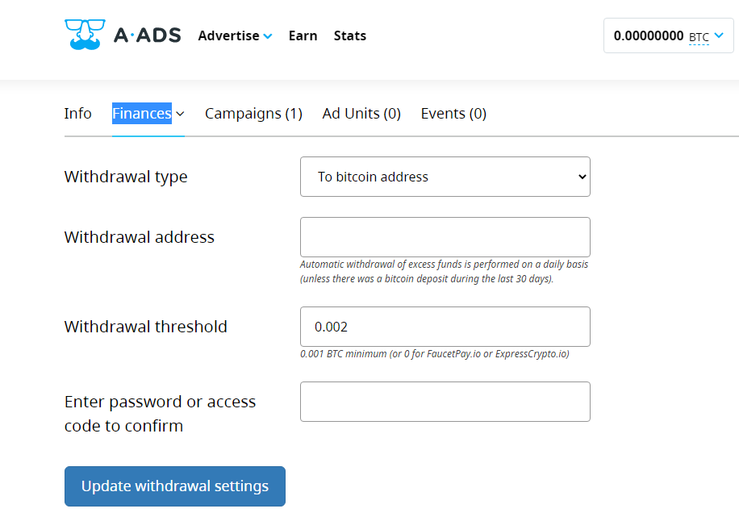
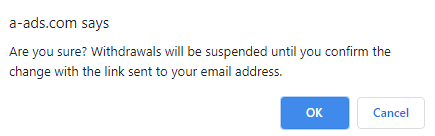
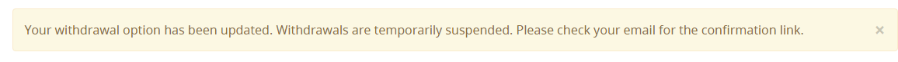
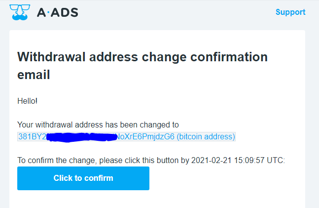

A-ADS strives to be as secure as possible, so we have enabled the measures to protect withdrawal changes via an email. This how-to describes how it can be done precisely.

1. Start with visiting the “Withdrawal options” page, which can be found at “Finances >> Withdrawal options”, it should look like the image below:

2. Select your “withdrawal type”.

Note: You can withdraw directly to a BTC address, or use FaucetPay; The withdrawals to FaucetPay are instant, but those to direct BTC addresses are processed only once a day.

3. Input either 

 • A valid “Withdrawal address”, or\
 • An existing address at FaucetPay (which must be registered in advance)

4. When withdrawing to a direct BTC address, you cannot set a “Withdrawal threshold” to less than 0.001 BTC.
5. Enter your password or access code.

Note: If you don’t have any means of authentication, probably because you used a social account to register, please use the email connected to your social account on [A-ADS password reset form](https://a-ads.com/user/password/new).

6. Click “Update withdrawal settings”, then click “OK” in the confirmation message:

7. You’ll see an event: 

8. Check the mailbox connected to your account, you should find an email from A-ADS with contents like this:

Make sure to check all your folders, including “Spam” if you don’t find our email in your inbox. Alternatively you can search e-mails by A-ADS.

9. Please, click the button, “Click to confirm”. At the destination page, you should see an event like in the image below:

Note: Once your withdrawal option is confirmed, **withdrawals will be suspended for three days, as a regular measure to protect your funds**.