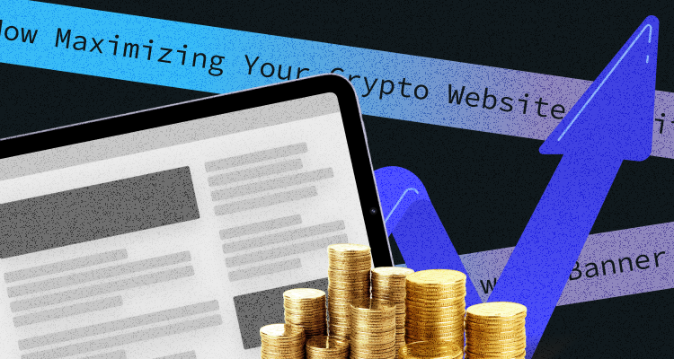

How to Earn Cryptocurrency in 2023You are wrong if you think it is too late to earn some crypto. The truth is, there are still hundreds of options on how to do it. ‘Cuz let's be honest, everyone wants to earn some cryptocurrency. But, we all remember that the crypto market can be pretty uncertain, so we don't want to risk our hard-earned money. Let's browse the best ways to get some crypto coins at minimum risk and even minimum effort. Yeah, this is possible, follow me!

## 10 ways to earn cryptocurrency

### 1. Start mining cryptocurrency

It seems evident that you should just start mining crypto. But, the problem is that it doesn't work for all currencies.

In a nutshell, mining is the process that cryptocurrencies use to generate new coins and verify recent transactions. But this process is complex and involves substantial decentralized networks of computers worldwide. Every transaction is documented through verified and secure blockchains and virtual ledgers. As the computers in the network contribute to their processing power, they are rewarded with some new coins. The blockchain, in its return, provides miners with the coins. So, it goes in circles when the miners maintain the blockchain and keep it secure. 

A decade ago, when we all lived in a slightly better world, anyone with a home computer could organize mining for crypto at their homes. You did not need some superpower to do so. But, as the blockchain has grown, the computation power demanded to maintain it has skyrocketed.

Now, you can hardly be successful in mining anything valuable. Plus, all mining is now done by specialized companies or groups of people who keep their resources together.

But if you want to try your luck with crypto mining, you don't have to invest thousands of dollars to get started. You can always join a mining network. All you have to do is pay the joining fee, and then you can work with other members to mine. The only disadvantage is that you'll also have to split the rewards.

But still, despite the difficulty, you can find the apps that help you mine cryptocurrency. For example, such sites as Kryptex. This application enables you to mine cryptocurrency and allows you to pay dollars or bitcoins. Kryptex's software is easy to set up and automatically starts working when you turn on the PC. 

Another one is Hashing24. You can mine crypto without any special equipment. It can automatically deposit your earned mined coins to the balance. The cons are that the only cryptocurrency you can mine is bitcoin. You also can check other sites like ChickenFast and BetterHash. They are all legit websites for mining free cryptocurrency. 

One more thing is before investing in anything, use unique resources to stay updated with crypto prices and decide whether a coin is worth mining or buying.

### **2. Earn crypto by buying**

Buying crypto seems like the easiest way to get some coins, right? Plus, it has never been simpler than before. As the industry became super popular in the past few years, its demand boosted. Many companies have started offering services that enable anyone to quickly and safely enter the market.

So, how can you buy cryptocurrency in 2023? 

Let's start with bitcoin. Buying this coin can be as simple as pie. You just go to a bitcoin ATM and get it with cash or credit. Though other crypto coins aren't so accessible, you can only buy them via crypto exchanges. But there's one thing you should think of, such as transaction fees.

On most online exchanges, transaction fees are updated in real-time, based on market changes. And the costs themselves are pretty low.

ATMs, on the other hand, usually have high transaction fees. So it's usually advised to buy coins through exchanges such as Coinbase, Binance, or Kraken. All you have to do is sign up for an account and verify it. 

But you should remember that some exchanges require verification from your bank, which can take up to several weeks.

Another option is a decentralized exchange (DEX) such as Uniswap or PancakeSwap. The compliance requirements are usually lower and may approve your account faster. But, keep in mind that trading tokens on a DEX are even riskier than on a centralized exchange.

### **3. Earn cryptocurrency by watching videos**

This way is relatively easy but not a smooth landscape yet. Most of the payouts are very low, and the videos can be boring to watch ‘cuz they are mostly ads. But some exciting projects go beyond advertising as well. 

One way is to use a site like CoinTube. CoinTube is a site that allows you to watch videos about cryptocurrencies and earn bitcoin. You need to create an account and then start watching videos. 

One more option that functions similarly is the CoinmarketCap Learning Center. Coinmarketcap has different videos and requires you to take a short quiz afterward, but the payouts and educational value are also high. You can also go for Odysee, which is positioned as an answer to Youtube, Permission.io, and PlayNano Online. This one is a project that lets you earn Nano by watching videos, playing games, completing surveys, and doing other activities.

### 4. Earn crypto by staking

First of all, what's staking? In a nutshell, staking is a way to put your crypto to work and earn rewards. It is pretty much like a bank deposit. You lock your crypto for a period earning some interest for it. 

It can be a great way to use your crypto to generate passive income, especially because some cryptocurrencies offer high-interest rates for staking. 

Ok, ready to take some easy steps? Follow me! 

First, you should buy a cryptocurrency that uses proof-of-stake, such as Ethereum or Cardano. Secondly, transfer your crypto to a blockchain wallet. After you buy your crypto, it will be available on the exchange where you purchased it. Some exchanges have their own staking programs with select cryptocurrencies. If that's the case, you can just stake crypto directly on the exchange. While staking can work differently depending on the cryptocurrency, most use staking pools. Find the staking pools available for the cryptocurrency you have. 

But! I want to warn you that there are a few risks to staking crypto, which you should understand. 

Crypto prices are volatile and can drop quickly. If your staked assets suffer a significant price drop, that could outweigh any interest you earn on them. Another risk is the possibility of hacking/cyber attacks on the protocol or exchange. This is the main reason some crypto investors stake in hardware wallets.

Also, remember that staking requires you to lock up your coins for a minimum amount of time. During that period, you cannot do anything with your staked assets, such as sell them.

### 5. Get crypto with DeFi

Ok, now we will talk about the next level of complexity. I will tell you first what the term DeFi means. If you want to buy a new car or a house, you need to address a bank to take out a loan, right? The bank, in this case, is an intermediary which regulates the transactions and checks that everything is fine and secure at all stages of the process. The bank should trust you to give you the loan. You, in turn, have to trust your bank. So, the traditional financial market is always about intermediaries, such as banks or stock exchanges. 

DeFi (pronounced dee-fye) got rid of those intermediaries and replaced them with software. You don't need a bank or a stock exchange anymore. Instead, you can directly address other people and buy what you need now from them. 

DeFi offers several ways of earning cryptocurrency. They are yield farming, lending, staking, and becoming a liquidity provider. Thus, yield farming requires investors to stake or delegate crypto assets to a smart contract-based liquidity pool and get rewards. By staking cryptocurrency, you can earn rewards by locking up your tokens for a fixed amount of time, depending on the plans offered by the operator. Some of the most popular DeFis are LuckyBlock, Uniswap, ShushiSwap, and many others.

### 6. Earn cryptocurrency by playing games

The play-to-earn crypto games concept is the most significant trend nowadays. You can not only play games but earn some crypto! Some games allow players to generate crypto rewards for their skills and effort.

Earlier games were more for pleasure and fun for someone who likes playing games. But, play-to-earn games have changed it. Now, game players have the initiative to earn real money as a reward.

But, some games need an initial investment, while some you play for free. And one more thing I should mention, these games are usually in their early development stages. It means their graphics look way more superficial than the top-level Xbox or Play Station you are used to. But give this industry a couple of years, and you will spot no difference. Instead, focus on the economics and the rewards, not the game itself.

Now, let's look a bit closer. You can check out the Sandbox for the beginning. The fans of Minecraft will like this game! This game is more like a creator platform than just a game. Users can create and animate their voxel assets, becoming NFTs uploaded to the marketplace. Users create their own assets and then sell them. They also get rewards for playing on the platform. The plots vary: gamers can build their creations using a game builder and modify them how they like.

Players can also buy a piece of digital real estate in The Sandbox metaverse called LAND and populate it with games and assets to build unique experiences. The metaverse comprises 166,464 Lands, which players can use for hosting tournaments, building housing, or developing multiplayer experiences.

Then, Plant Vs. Undead. This game is about a meteorite-hit planet where the animals have turned into the undead trying to kill the mother trees. However, the flora has evolved too, fully prepared to fight adversaries. The native token is PVU stored on Binance's Smart Chain, whereas the in-game currency is named Light Energy (LE).

There are plenty of other games to choose from, but remember that you should be careful of games asking for initial investments, owing to the crypto-volatility.

### 7. Earn Cryptocurrency joining a network of publishers

Do you have a website or a blog? Then you can start earning some coins. 

Since Google banned or restricted crypto-related businesses from advertising through its network, the advertising industry had to adapt. Countless crypto ad networks (such as A-ADS) were created to fill the market's advertising needs. Their platforms created vast networks of crypto-publishers, where advertisers could place their banners.

So, let me tell you about our Publishers' advantages. Firstly, it takes less than a minute to become a publisher! You should go to our website and follow three steps:

1. Fill out the ad unit creation form to get HTML code. It's pretty simple!
2. Insert it on your website.
3. Wait for your earnings!

What's more, we provide alternative technologies for monetizing your traffic. In addition to the ability to sell ads on your website directly, you can earn from the pool of active advertisers. Our distributed, scalable infrastructure ensures reliable ad delivery all around the world. 

In return for displaying ads, the publisher gets paid. And while most networks will pay out their users in only one currency (such as EUR or USD), many also do payouts in cryptocurrency.

### 8. Accept crypto payments

One more way to earn some crypto coins is to start accepting crypto payments. The process isn't complicated. Platforms such as Shopify or WooCommerce allow customers to accept cryptocurrencies as payment through their website. If you own an e-commerce website, then it's your time to shine.

And not talking only about bitcoin. For example, WooCommerce allows its users to accept 50 types of crypto coins, while Shopify goes even higher, with more than 300.

If we talk about Shopify, you must enable an alternative payment method from your Shopify account.

For WooCommerce, you'll have to install one (or more) additional plugins, such as BitPay or CoinGate. When installed, just activate it, configure it, and you're good to go.

### 9. Start freelancing and get paid in bitcoin

Maybe this is not an obvious way, but definitely one of the easiest to try! You can earn coins by securing a job that pays in cryptocurrency. And you will be surprised at how many online platforms have set it as their Payment method. Finding a freelance project for you would not be a big problem if you have the required skills.

Heaps of platforms facilitate freelancing through blockchain technology. Most don't have any costs or transaction fees, so freelancers receive precisely what the employer pays.

Feeling uncertain about receiving your paycheck in crypto due to volatility? No worries! You can always opt for a more stable cryptocurrency. You can start your crypto freelance career with such places as CryptoGrind, BlockLancer, BitGigs Earn, and others. 

### 10. Use cryptocurrency and payment platforms

Last but not least is the way to profit from cashback functionality.

Cryptocurrency and payment platforms like Crypto.com now offer financial management applications that can help you earn more cryptos using the funds you already have.

You can profit from cashback functionality without counting earning cryptocurrencies from depositing and picking up interest.

### Conclusion

So, let's sum up, the crypto industry is massive! 

In this article, I have tried to cover some of the safest methods of earning. It's up to you which one to choose.