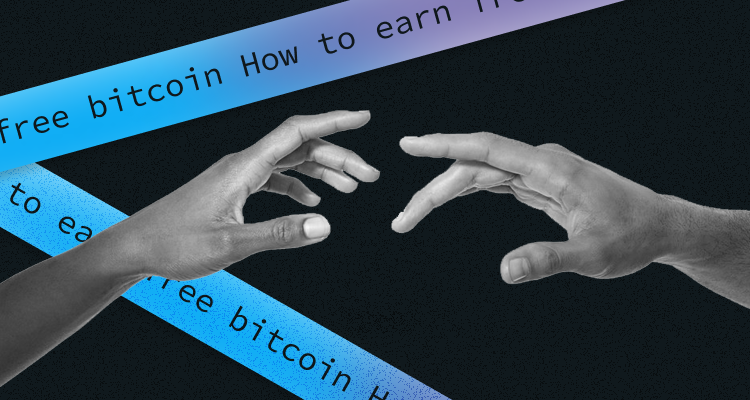

## How to earn free bitcoins - 15 Best ways

Yep, free bitcoin exists. We didn't make it up. And in this article, I will tell you how to get some precious free coins. Some ways are more accessible, but free crypto is possible if you are motivated enough. Without further ado, let's explore the world of free bitcoins!

First, one of the best ways to earn some free bitcoins includes shopping rewards with credit cards, referral bonuses, playing games, and participating in trading competitions. (But only if you are an experienced trader; otherwise, I wouldn't recommend such risky methods). Exchanges and platforms offer plenty of sign-up ideas, trading bonuses, and refer-a-friend deals. You name it. Let's get deeper and see what else you can try to get some free crypto.

### Best way to earn free bitcoins

**1. Find sign-up promotions and competition** 

Let's begin with getting some free bitcoins. Many popular crypto exchanges offer new users a simple, lump-sum sign-up bonus. This is to capitalize on promotions and bonuses that offer free bitcoin in exchange for signing up to a platform.  

For example, Gemini gives $25 BTC to new UK users who trade $100 in the first 3 days.

**2. Play games and get free bitcoin**

The best crypto games work the same as classic video games, except they are hosted on the blockchain rather than game consoles. So many online games reward small amounts of bitcoin as a prize. The games work equally to bitcoin faucets.

The bitcoin bonuses encourage investors and users to play games and view ads. Plus, the games provide myriad benefits, most notably, the ability to use cryptocurrency within the game for specific tasks. To be honest, the reward amount tends to be pretty low. But it is still worth trying, right?

For example, Lucky Block is building a crypto game around a number-drawing process. If your number is chosen from the random daily draw, you will win a percentage of the jackpot prize. Now, to buy a ticket to enter the interest costs $5 – payable in the project's native digital token, LBlock.

But, Lucky Block offers the opportunity to earn a free ticket – meaning that you can bypass the $5 requirement. You just need to hold an allocation of LBlock tokens and connect your private wallet to the Lucky Block app each day.

**3. Earn a return on bitcoin that you already have in your wallet**

Do you already hold bitcoin within a crypto portfolio? Great! That means some crypto products allow you to generate a yield from your assets. If you already have some bitcoins in your wallet, check if your exchange offers a way to earn an annual percentage yield (APY) on your digital assets. 

Usually, people associate bitcoin with a Proof-of-Work blockchain. Lending or "off-chain staking" is one of the more common options. Yield-generating products typically include on-chain staking, for Proof-of-Stake blockchains, and lending products where digital assets are lent to third parties to generate a return on investment.

**4. Refer a friend**

Sometimes you just don't want to sign up for a new exchange to tap or something, so another option is to recommend your exchange to a friend. There are loads of affiliate programs that are widely available in the cryptocurrency industry.

For example, you can earn free Bitcoin instantly by applying for the Binance bitcoin referral program. You can refer your friends, giving you 20% when they make a transaction. Your friend also gets a 20% discount.

Such resources as Gemini and Kriptomat now offer excellent bonuses of Bitcoin if you refer someone. In this case, you both get a bonus. The platform eToro also presently provides $50 for referrals.

Well, there are some hoops you have to jump through before getting your bonuses. You'll usually need to use a specific referral link or code, and your friend might need to place a trade before you get your reward. One more thing that both Kriptomat and Gemini require is that your friend needs to buy a minimum amount of cryptocurrency in a certain period before you can both receive your bonuses.

**5. Get bitcoin cashback on your shopping**

Like shopping? Now you can not only spend your money but also earn free bitcoin by shopping online with the help of shopping reward companies. Several browser extensions and web browsers now allow you to earn bitcoin rewards if you do some tasks online. Shopping with partner retailers can also help bolster your bitcoin holdings over time. 

For example, the app Lolli gives you free Bitcoin when you shop over 1000 top stores. For that, you need to download this app. 

**6. Cashback in crypto**

We are all used to cashback options from our banks. A similar option is provided by CoinCorner, which launched its "Bitcoin Cashback" in 2020. There are two ways that you can make some free Bitcoin using CoinCorner. You can browse its directory of online retailers and shop as usual. Or you also can download its bitcoin cashback extension and receive a pop-up when you visit a partner retailer site, so you will be notified of Bitcoin cashback offers. These partner retailers include B&Q, Schuh, Boots, and Curry PC World.

 **7. Perform micro tasks or crypto faucets**

Another brilliant way to earn some crypto coins is to use crypto faucets. In a nutshell, crypto faucets are a way to generate small sums of crypto regularly for completing quick and easy tasks. You don't need to have high skills to do it. But, the tasks can be rather monotonous. Still, if they are performed over the longer term, this is the way to create a notable income stream. Tasks include taking surveys, playing games, or simply watching some videos.

If you have a lot of free time and this idea interests you, one widespread crypto faucet worth checking out is Cointiply. According to Cointiply's website, over $7 million has been paid in bitcoin rewards since the platform launched. Through the platform, users can participate in surveys, play games, sample new products and businesses, and, in return, earn points. Depending on a user's preference, these points can then be converted into BTC, LTC, DASH, or DOGE. The minimum withdrawal limit on the application is equivalent to $3.

We just want to warn you that some websites can be created by scammers that will not release promised bitcoin funds. Depending on the platform, it can also take a very long time to earn a redeemable amount of BTC.

 **8. Get Bitcoin to Ads, Affiliates, And Referral Sites**

This excellent method for getting free bitcoins is to sign-up for an affiliate program that gives its rewards in cryptocurrency. It works pretty simply. You receive a commission when somebody clicks on your affiliate link and proceeds to register and/or deposit funds with the provider. 

To prosper in this marketplace, you need to think of ways to get your affiliate link in front of people. This affiliate program, for example, can be offered by A-ADS. You can start sharing your link with your family and friends.

**9. Do Jobs That Pay in Bitcoins**

Work as a freelancer? Awesome! You can find a company that pays you in bitcoin. There is a huge demand for website testing, taking surveys, retweeting companies' posts, analysing or optimising websites, or simply completing other small tasks.

Many other websites offer small bitcoin rewards to the person who provides the correct answer to one of their questions. You can find a specific job that pays you in bitcoin on BitcoinGet. You can also answer questions for bitcoin on Bitfortip.

**10. Donations** 

You can earn bitcoin instantly via donations. It's easier than it might look. First, you need a website, and you can ask for bitcoin donations on your website using a wallet address and QR code.

**11. Writing and research info products** 

This option also requires your feedback on something. Some cryptocurrency blogs, news outlets, and forums will pay you in cryptocurrency to contribute your insights or feedback writing for them. But, to do this, you should know about the industry. You can find article writing gigs for crypto blogs and news outlets on job boards like Coinality.

**12. Get Tipped**

Lastly, you can simply be tipped in crypto by accepting it as a payment method. You will need a digital wallet with a QR code of your BTC address on it. People can give you bitcoin tips using your bitcoin QR-code address.

**13. Get bitcoins by completing educational courses** 

You can earn crypto by watching some educational videos, with small 'rewards' distributed on completion. This process can be simply described as "Learn and Earn." It may seem too good to be true, but it is offered by an array of top platforms. For example, the "Coinbase Earn" service will reward you for watching educational videos and completing quizzes, with specific quizzes providing larger payouts than others.

**14. Sell your goods and earn bitcoins**

Another simple way to earn free bitcoin without risking any capital is to list your unwanted goods at an online marketplace specialising in crypto deposits and withdrawals. Similar to eBay, platforms like Ethair allow you to list goods via a 'Buy Now' or auction setting. 

When one of your items is sold, you can receive the proceeds from the sale in bitcoin. You can later withdraw the bitcoin to your wallet. Best of all, Ethair does not charge any commission when you sell items on its platform. Great, right?

**15. Airdrops** 

Airdrops are another no-risk way to earn free bitcoin without living at home. When a new cryptocurrency wishes to market its project to the broader markets, it will often 'airdrop' tokens to those that join its community.

In other words, you can earn free digital tokens simply by signing up for an upcoming airdrop – of which there are many. If the project in question becomes successful – you stand the chance of being able to swap your free airdropped tokens into bitcoin via an exchange.

### Best Platforms for Earning Free Bitcoin

Heaps of platforms around allow their customers to earn some free bitcoins. Some of them are well-known, and others are less known. We will tell you about the two best of them. Let's start with Aqru: 

* **Aqru**

The platform Aqru possesses itself as the Best for Earning Bitcoin With Interest. Ok, let's see its benefits.

As we said earlier, the best way to earn some free bitcoins regarding risks and the effort required is to open an interest account. The platform Aqru allows you to do it. It was created for this purpose, as you will earn an APY of up to 7%.

You can quickly transfer crypto into your account in seconds using a crypto wallet or purchase crypto through the Aqru platform. Aqru has no lock-in periods and allows you to access your holdings whenever possible. Rates currently sit at 7% per year on BTC and ETH deposits and 12% per year for USDT, USDC, and DAI deposits.

One more thing is that Aqru does not require you to lock your BTC tokens away – as all accounts are flexible. There is no limit to the amount of bitcoin you can deposit, and the 7% APY is not capped in any way. So, if you're looking to earn some interest in your bitcoin holdings, Aqru is an excellent option, especially for beginners.

* **eToro** 

The platform eToro is the best for earning bitcoin with automated trading or investing. The platform warns about the risks you can face if you want to maximise the amount of bitcoin you can reach. Let's take a closer look.

EToro is a top-rated broker that is now used by over 25 million people worldwide, and its platform is regulated on multiple fronts. The platform offers several options. The first one that you have to do is to utilise the copy trading tool and social trading crypto features.  

This allows you to passively day trade cryptocurrencies, as you will automatically copy the positions of your chosen investor. You can select an investor based on your experience and the reviews.

One more option to try is a crypto-centric smart portfolio. These represent diversified baskets of digital currencies, and your portfolio will be managed by the eToro team on your behalf. This is a purely passive investment opportunity, and eToro will rebalance the portfolio regularly.

What about the prices? eToro allows US clients to deposit funds free with a debit/credit card, e-wallet, or bank wire. You don't have to pay additional fees for the copy trading or smart portfolio tool. 

Before you start working with eToro, we'd like to say that you need a minimum deposit of just $10 for US and UK customers or $50 elsewhere.  

### Conclusion 

WOW! We have just discussed so many ways that you can try to earn some free bitcoin. Just find the way that suits you best and go ahead! Top methods we came across include bitcoin interest accounts, crypto credit card cashback programs, and exchange sign-up bonuses.