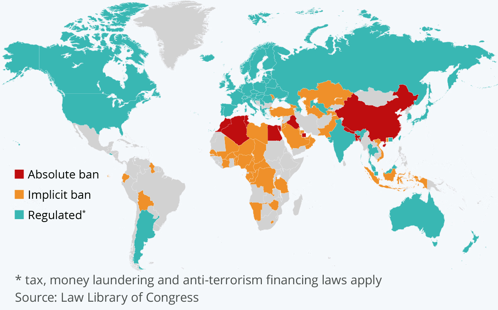

What are the best work perks? Some say that flexibility and remote work from home are the most wanted perks. But one more bonus that is getting increasingly popular is the option of being paid in cryptocurrency. 

According to a global financial consultancy deVere Group poll, cryptocurrency could soon become more common in salary negotiations with younger workers. Their research has shown that more than a third of millennials (people between 26 - 42) and half of the younger generation (25 and below) would be happy to earn half their salary in bitcoin or other cryptocurrencies. 

A crypto salary is a perfect option. But let's explore its pros and cons first for employees. 

## Advantages Of Being Paid In Cryptocurrency

* **Speed**

The first significant benefit of crypto is speed. Forget about waiting! Cryptocurrency transactions go almost instantly, compared to traditional SWIFT transactions. 

* **No Intermediaries**

Crypto transactions are made on a peer-to-peer network without intermediaries like banks. If someone sends you some crypto, it goes directly to you.

* **It's Decentralized**

One more benefit is that crypto's value is independent of government or financial institutions.

* **You Can Use Crypto As An Investment**

The crypto price has the potential to rise in the future. Employees could collect much more than their initial salary if the value of crypto rises.

* **Crypto Is Appealing**

Although it is a subjective criterion, I will still put it on my list of advantages. Research on [pewresearch.org](https://www.pewresearch.org/fact-tank/2021/11/11/16-of-americans-say-they-have-ever-invested-in-traded-or-used-cryptocurrency/) revealed that almost nine in ten American adults know about crypto. Many employees and freelancers now pursue crypto payments. Flexible payment options like crypto withdrawals can give a company some additional bonuses and attract more promising staff.

Ok, now that crypto salary looks attractive, it's time to explore its pitfalls. Forewarned is forearmed, right?

## Disadvantages Of Being Paid In Cryptocurrency

* **Volatility**

You probably already know that the crypto market is volatile. Even bitcoin is highly volatile — it has fallen significantly sharply a year ago. Such volatility creates the thread that employees could potentially get less than their initial salary by accepting payments in crypto. 

* **Cyber Attacks** 

Though cyberattacks aren't unique to cryptocurrency, they likely remain as long as crypto remains popular. So, make sure your money is kept securely. 

* **It's Not Globally Accepted Yet**

Cryptocurrency regulations vary across countries, making it challenging to establish crypto payroll services globally. Some countries have just banned crypto within their borders; others have unique rules and tax treatments and often change regulations.

* **It's Not Integrated With Existing Systems**

Another disadvantage is tightly related to the above one. The vast majority of banks don't support crypto. But the good news is that crypto-based systems are changing the world.  

Now that you know about the pros and cons, let's see how you can get paid in cryptocurrency.

## Easiest ways to get paid in cryptocurrency

* **Working For Crypto**

A pretty obvious option, right? You won't believe it, but some companies offer an opportunity to pay a salary in crypto. For example, more than 4000 workers at the Japanese Internet firm, GMO Group, have the chance to get their compensation in bitcoin.  

Several job-seeking websites allow freelancers to find customers and get paid in cryptocurrency. Thus, [Ethlance](https://www.linkedin.com/company/ethlance) allows its users to hire or work for Ether (ETH). Another one is [Coinality](https://bitcoinjobs.com/), which aims to connect employees and job seekers with job opportunities that pay in digital currency.

If you currently have a job, ask your employer whether it's possible to get a portion of your salary paid in bitcoin. 

* **Peer-To-Peer Via Non-Custodial Wallets**

For this option, both parties need to set up a wallet to store their coins to send crypto directly through the decentralized blockchain network. I have already mentioned that different coins have different wallets. These wallets are non-custodial, which means you have to take care of the security yourself. 

Crypto-network transactions require some technical expertise. Tools such as [Metamask](https://metamask.io) can help to simplify these procedures.

* **DIY Crypto Pay**

Suppose your employer isn't offering crypto yet. No problem. In that case, you can convert your paycheck dollars into crypto by buying crypto from an exchange. But keep an eye out for extra transaction fees or network charges in the blockchain.

* **Earning A Passive Income**

This process is similar to buying shares of a company that pays dividends to shareholders. The crypto world borrowed this practice, which led to the dividend payments to coin or token owners. That means you can have some passive income generated for you.

The two most common ways to get dividends are:

* By staking crypto. You can earn extra coins by storing a proof-of-stake coin in a particular wallet and receiving some interest.
* By holding crypto. You can make some interest in your cryptocurrency by buying and holding a specific coin or token in any wallet.

For example, Komodo (KMD) pays an annual reward rate of 5% to KMD holders, while NAV Coin (NAV) pays up to 5% interest to their users.

* **Crypto Mining**

This option is challenging nowadays, so you can hardly be successful in mining crypto. Nearly all mining now is done by specialized companies or groups of people. But if you want to try crypto mining, you don't have to be filthy rich, as you can always join a mining network. Pay the joining fee, and then you can work with other members to mine. The only disadvantage is that you'll also have to split the rewards.

## Some Other Ways To Get Paid In Crypto

There are still some methods left that are worth mentioning. First, you can answer cryptocurrency questions on the website called [Cent](https://beta.cent.co/~featured/). This project rewards users with ETH if they answer voted to be one of the best. Secondly, you can use paid-to-click websites that pay users in cryptocurrency to visit certain websites or view specific ads. One more thing is to do some micro jobs via Earn.com. The tasks are small, but the payment is also relatively low.

## Is Crypto Wage Legal? 

Let's imagine you are the lucky one who got your salary in cryptocurrency. Then, the question which might bother you is to what extent is crypto salary legal? The short answer is yes, and crypto salary is legal. But regulations around cryptocurrency are complex and still in flux.

The U.S. The Library of Congress has collected data on crypto legal status worldwide, which you can check [here.](https://tile.loc.gov/storage-services/service/ll/llglrd/2021687419/2021687419.pdf)  

The report shows that some countries are rather friendly towards crypto, for example, the USA, where bitcoin is a "money services business." Whereas some countries such as Algeria, Bangladesh, China, Egypt, Iraq, Morocco, Nepal, Qatar, and Tunisia have an absolute ban on crypto. So owning or trading crypto there is illegal.

Forty-two more countries have implicit bans on cryptocurrencies, meaning the government restricts banks and financial institutions from dealing with crypto or offering services to crypto providers.

But, despite this list, there are still dozens of countries where having a crypto salary is not a big deal.

## Who Typically Gets Paid In Crypto? 

As mentioned above, some companies are savvy enough to offer their employees a paycheck in cryptocurrency. Other lucky ones who receive payments in crypto are freelancers and self-employed, as they can choose whom to work with and what to be paid. But that's not all. Do you have a website or a blog? Then you also can start earning some cryptocurrency.

Since Google banned or restricted crypto-related businesses from advertising through its network, the advertising industry had to adapt. Countless crypto ad networks (such as A-ADS) were created to fill the market's advertising needs. Their platforms created vast networks of crypto-publishers where advertisers could place their banners. It takes less than a minute for A-ADS clients to become a publisher and start earning. You should go to the A-ADS website and follow three simple steps:

1. Fill out the ad unit creation form to get the HTML code 
2. Insert it on your website
3. Wait for your earnings

What's more, A-ADS provides alternative technologies for monetizing your traffic. In addition to selling ads on the website directly, you can also earn from the platform's active advertisers pool. In return for displaying ads, the publisher gets paid. And while most networks will pay out their users in only one currency (such as EUR or USD), many also do payouts in cryptocurrency. 

You also can become an advertiser to earn crypto. Platforms like A-ADS have over 120000 publishers that give access to various categories, such as lifestyle, blogs, crypto sites, and many others. That variety allows advertisers to reach their target audience. Click here to start a campaign. (ссылка на главную страницу чтобы создать рекламный баннер)

## Tax Treatment Of Cryptocurrencies

One crucial question to consider when looking for a crypto-paid job is tax regulation in your country. For example, in the European Union, bitcoin is exempt from VAT (value-added tax) in light of a 2015 Court of Justice of the European Union ruling.

In Israel, bitcoin is also a taxable asset. At the same time, in Switzerland, it's considered a foreign currency. Argentina, Denmark, and Spain see it as income tax. In the U.K., taxes depend on who pays them. Thus, U.K. corporations pay corporate tax, unincorporated businesses pay income tax, and individuals pay capital gains tax on crypto-profits.

**To learn more about tax treatment, you should do the following:**

* **Try to figure out how much profit you made from selling crypto.** Then, multiply the sale price of your crypto by the amount of the coin you sold. After that, subtract how much you originally paid for the crypto and the fees for selling it. The final figure that you get is your profit. This is your tax basis.
* **Your next step is to decide whether your crypto assets are short-term or long-term investments.** Determine the date you purchased your crypto, and then note the current date. The period in between is called your holding period; that is, how long you have owned it. For example, one year of holding or less is a short-term gain. If longer, it's regarded as a long-term gain. Your tax rate will depend on this. 
* **Long-term gains are calculated differently than capital gains**. Short-term gains are treated as ordinary income; therefore, your tax liability will depend on your particular income range. You can find your earnings and multiply your payment by the percent designated in the tax bracket. Then your tax liability will be calculated using a capital gains tax rate on the profits of your cryptocurrency. It's worth noting that long-term gains offer lower tax liabilities.

Getting a salary in crypto would be treated like any other income for tax purposes. Companies must report payments in local currency for income tax purposes. Crypto could have additional tax appeal for high earners. For example, in the U.S., profits from bitcoin have capital gains tax rates of 20%, which is lower than the current top income tax bracket of 37%.

## Conclusion

With cryptocurrency getting increasingly popular, it may be tempting to want to bet more of your money on digital currency, but be wise. Consider your financial situation and goals if you intend to get into crypto. Review basics like your monthly cash flow, budget, and expenses. Then decide how much of your budget you can have in crypto. 

Good luck with your crypto paychecks!