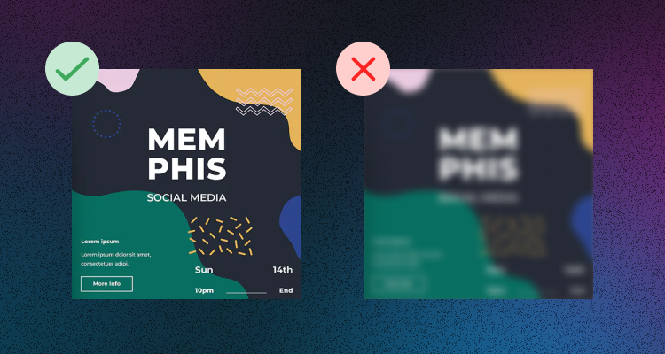
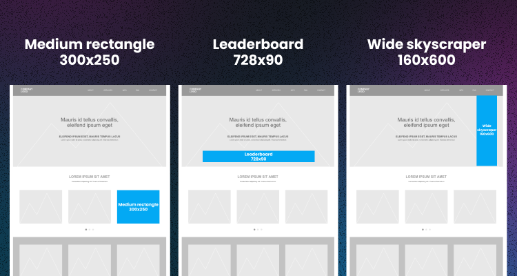

Crypto or blockchain-related websites and platforms can maximize profit by placing banner ads. In this article, we have collected several ideas on how to do it effectively, what things to avoid, and how to keep your customers on your website longer and profit with crypto ads.

### 1. Set The Frequency Of Your Banner Ad Display

Mobile banner ads usually stick on the page when users browse the content. You can set the frequency at which the banner content refreshes to show a new advertisement. In general, the refresh time varies from 25 seconds to 2 minutes. In some apps, setting the refresh time to every 30 seconds could be effective, while a longer refresh time is better in other apps. Choosing which option is better is debatable, and everyone should choose their approach.

### 2. Check The Responsiveness Of Your Ads

This piece of advice is simple: the higher the quality of your pictures, the higher the responsiveness. To achieve the best results, avoid using ads with blurry, vague, unclear images, including a border, color-inverted, or massively filtered. 

Instead, add a good logo of the advertiser's brand along with a headline or descriptive text. Moreover, formats like interstitials and video are more suitable for mobile ads than simple banner ads. 

However, if most of your website traffic comes from desktops, you can focus on something other than mobile advertising.

### 3. Test Different Banner Sizes

Testing different banner sizes can help you find what works best for you. 

Some sizes help increase ad impressions, and others achieve better CTR or an engaging user experience. Depending on the payment method used by your ad network (CPC/CPM/CPA), test out different sizes and check which one gives you the most earnings. For that, use A/B tests and compare your results. 

The most popular and often used banner ad sizes are medium rectangle (300×250), leaderboard (728×90), and a wide skyscraper (160×600).

### 4. Try Different Ad Formats

Ads formats can be quite different, starting from static ads, popup ads, and, most famous nowadays - video ads. 

Given this variety, it can be a good idea to experiment with different types of ads to see which ones are well-received by your audience.

### 5. Add A Call-To-Action Button 

A call-to-action button convinces visitors to click on the ad and leads them to the landing page. It would help if you made this button more attractive and visible to get more transfers from the ad button to the website. So users can easily find it on the ad babber, get interested in learning more information, and then go to the website.

### 6. Track And Measure Ads' Results

To see if your banner ad works successfully, you should constantly measure its results to optimize its work. Analytics will cue the number of clicks and conversion rate and show you what works well for your users.  

The best ad networks always have analytics on their dashboards, so you can easily optimize your ads' performance.  

### 7. Include Ads Directly In Your Content

One more hint to increase your effectiveness is to connect your ads with the content on the web page, as content-based ads are hard to miss. 

In addition, to make your crypto banner ads more effective, avoid using too many ads on a single page. A user's attention is limited, so multiple ads can overwhelm the visitor and make your ad less effective. Instead, stick to one or three well-placed banner ads. 

## Best place to advertise a crypto website

Probably the most crucial part of your successful crypto ad campaign is choosing the right ad network, as a proper ad network can bring you the most profit.

At A-ADS, the biggest and oldest cryptocurrency ad network, we care about your ads' effectiveness and provide over 70 million impressions and over 60,000 clicks daily. A-ADS has a convenient interface for advertisers and includes customizations such as geotargeting and ad placement options. To learn more about our advantages for publishers, check our [main page](https://a-ads.com/). 

Overall, banner ads are successful tools for your crypto business or product. Just make sure you choose the best marketing strategies and crypto advertising platforms and make your ads fresh and appealing to customers.