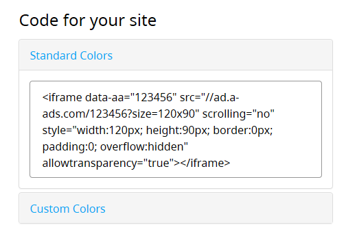
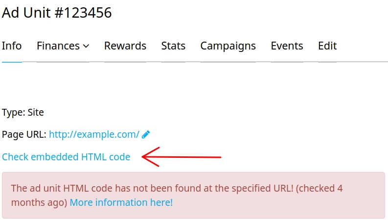

It only takes seconds to copy-paste a provided ad unit code to your website page. You can find the code in the right-bottom corner of an ad unit’s main page, in the section called "Code for your site".

What we consider an ad unit code is an iframe like:

`<iframe data-aa="123456" src="//ad.a-ads.com/123456?size=728x90" scrolling="no" style="width:728px; height:90px; border:0px; padding:0; overflow:hidden" allowtransparency="true"></iframe>`

where **123456** stays for your ad unit number.

Still, some of our publishers face difficulties in embedding the code into their sites and receive a yellow message "The ad unit HTML code has not been found...":

How can we go about it? Here are some ways.

1. An ad unit must be present on that very page you specified for it in the ad unit settings, as our bot checks only this page. 
2. Make sure our bot can access your ad unit on the page specified in the settings. This means the page should be accessible with no CAPTCHAs,  pop-ups or authorization. 
3. If you use Cloudflare or another anti-DDoS service, you’ll need to whitelist our bot IPs. You can ask for them our support team.
4. There’s no problem in using the same code within a whole domain. Using the same ad unit for several domains is not prohibited, but it will lower your earnings as unique impressions will be counted only for one domain - domain of the page the ad unit is assigned to and its subdomains.

And here are some tips that will help you on the way:

* Our bot uses a VPN, so if you disallow VPN access, the bot won’t be able to check code presence. A possible solution is to whitelist the bot IPs.
* Be careful if modifying the provided code. If you eliminate "data-aa" attribute from your phrase, the banner will not be found. We use this attribute to differentiate our banners from other HTML elements on the page. 
* If you use the code on different website versions, make sure it’s available for check on desktop layout, otherwise it won’t be found.
* You can launch the bot manually. Just click on "Check embedded HTML code" and your page will be checked within 10 minutes.

If you’ve checked all possible issues and the problem remains, please contact our support team. We’re always ready to help you.