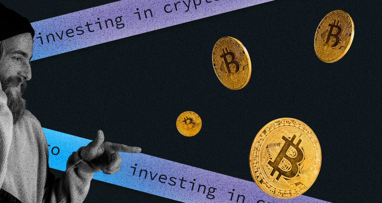
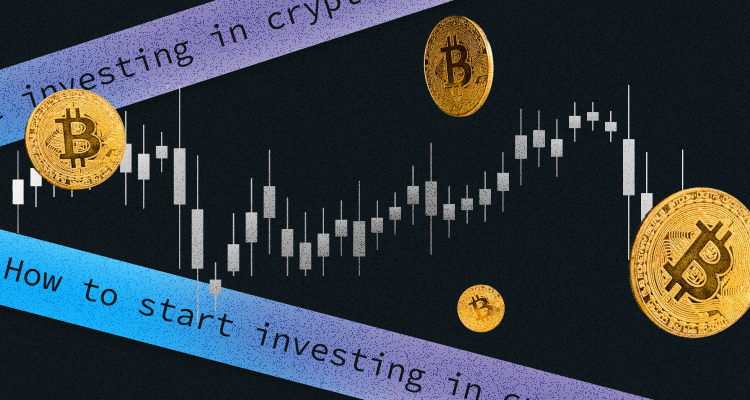

## How to start investing in cryptocurrency in 2023

**A Beginner Guide**

If you have only entered the world of cryptocurrency, you probably have many questions about it. As many people need help understanding blockchain technology, it is even more complicated to figure out how crypto investments work.  

If you need clarification about how and where to buy crypto, this article is a guide that explains how to start investing in cryptocurrency. 

Let's start with figuring out what crypto coins are worth investing in for beginners. 

## Best Cryptocurrencies For Beginner Investors

There are more than 20,000 cryptocurrency projects on the **$870 billion** crypto market. And choosing which one is worth buying takes a lot of work. 

First, you must know the *type of cryptocurrency system* you plan to invest in. Bitcoin is the oldest and the most significant kind of crypto, with a market capitalization of about **$309.9 billion**. It has been on the market for more than ten years showing its peaks and scary falls. New investors often choose Bitcoin as every exchange supports this currency. You can also use it to exchange currency, which gives it a competitive advantage.  

Another is Ethereum (ETH), the second largest and most popular cryptocurrency with a market cap of **$138.1** **billion.** This crypto has potential applications, which are so-called smart contracts. These smart contracts are a type of Ethereum account. They have a balance and can be the target of transactions.

Other popular projects to have a look closer at are: 

* **Tether (USDT)** - with a $65.5 billion market cap. Tether is a stablecoin, which means fiat currencies back it, like U.S. dollars and the Euro, and hypothetically less volatile. 
* **U.S. Dollar Coin (USDC)** - another stablecoin with a $44.1 billion market cap.
* **Binance Coin (BNB)** - a form of currency belonging to the crypto exchange Binance with a market cap of  $42.2 billion. You can use this coin for trading, payment, or booking a travel hotel. You also can use it for trading or exchanging for another crypto, such as Ethereum or Bitcoin.
* **Cardano (ADA)** - This cryptocurrency primarily stores private data. Its market cap is $10.83 billion. An alternative to Ethereum is more energy-efficient and way less expensive. 

Other cryptos worth checking are Dogecoin (DOGE), Polygon (MATIC), and Binance USD (BUSD). 

There are plenty of other potentially successful projects on the market, so do your research and find the one you like more. Here is the list of several places to monitor what new crypto coins are coming online:

1. **Cryptocurrency exchanges:** Coinbase, Gemini, Kraken, Crypto.com, Binance, Gemini.
2. **Data Aggregator:** Coingecko, CoinMarketCap.
3. **Social media:** Twitter, Telegram, Discord.
4. **Websites:** Top ICO, Smith & Crown, ICO Bench.

## What Do You Need To Invest In Cryptocurrency?

It would help if you had some basic things to start investing in cryptocurrency. They are: 

1. Personal identification documents (ID, passport, or driver's license)
2. Bank account information
3. Secure internet connection 

That's it! And one more thing before we move further is taxes. In many countries, cryptocurrency is considered an asset, like shares or property. When you sell crypto and make some profit, you have to pay capital gains tax on what you earn. To calculate taxes, you can use some online crypto tax calculators like [CryptoTax](https://cryptotaxcalculator.io/) or the one that Forbes created in [this article. ](https://www.forbes.com/advisor/taxes/cryptocurrency-tax-calculator/)

The second crucial thing to figure out before investing is whether you are a long-term or a short-term investor. As cryptocurrency is a highly volatile asset, many investors choose to be a short-term investment. But, cryptocurrency may become a stable investment in the future, and those long-term holdings will yield significant profit. But that's only a possibility. 

## Ways To Invest In Cryptocurrency

There are at least several ways to invest in crypto: on an exchange platform, via a broker, or through indirect investment such as funds or companies connected to cryptocurrency. Let's have a closer look at the last two options: 

* **Invest in Crypto Exchange-Traded Funds (ETFs)**

Investing in funds is extremely popular on the stock market among investors. Funds help to diversify risks and buy plenty of different assets without spending a fortune. Funds are also less risky than investing in individual investments.

* **Invest In Companies That Are Connected To Cryptocurrency**

One more way is to choose a company already connected to the crypto world and invest in it. Such companies may use or own cryptocurrencies and blockchain technologies that help to run businesses. So you can buy shares of Nvidia (NVDA), PayPal, or Square (SQ) via a broker, as these companies are public. 

If those two options are not for you, let's see what steps to take if you want to invest directly in cryptocurrency. 

## Five Steps For Investing In Cryptocurrency

1. **Choose An Exchange Platform**

To buy crypto, first, you need to pick a crypto exchange like Binance, Coinbase, Kraken, or Gemini. These exchanges are platforms where buyers and sellers trade cryptocurrencies. These exchanges are popular for several reasons:

* They often have relatively low fees
* They are easy to use
* They also have excellent educational materials, which are especially helpful for beginners 

2. **Create And Verify Your Account**

After you have chosen your exchange platform, sign up to open an account. It usually takes a little time. Depending on the platform and the amount of crypto you plan to buy, you may undergo identity verification. The platform may ask you to submit a copy of your ID or passport to prove your identity. Don't avoid this step, as it is vital to prevent fraud and meet regulatory requirements. You can buy and sell crypto once your verification is done.  

3. **Deposit Some Cash For A Start**

Now you need to have some money on your account to buy crypto. You can do it by depositing money into your crypto account, linking your bank account, or making a payment with a credit or debit card (but this option is the riskiest and most expensive). Sometimes you have to wait several days before you can use your money.  

4. **Place Your Order**

Now with some money in your account, place a cryptocurrency order. Choosing from such a considerable variety may be challenging, but you can always start with the most popular ones. 

5. **Select A Storage Method Or A Wallet**

Cryptocurrency exchanges may be at risk of theft or hacking. It means you can lose all your earnings or savings if you forget or lose the key to your account, as [millions of dollars](https://www.nytimes.com/2021/01/13/business/tens-of-billions-worth-of-bitcoin-have-been-locked-by-people-who-forgot-their-key.html) of Bitcoin already have. That's why your next step should be to choose a secure storage place for your cryptocurrencies. 

6. **Keep Crypto On Your Exchange**

When you buy cryptocurrency, you usually store it in a crypto wallet which is attached to the exchange. Some popular exchange platforms have their wallets. If you don't like your exchange's wallet, you can transfer your assets to a separate hot or cold wallet. Depending on the exchange and the transfer size, you may have to pay some fee. 

Hot wallets include desktop wallets, web wallets, and mobile wallets. All you need to know about hot wallets is that they offer easier accessibility because they are connected directly to the Internet. But, at the same time, they are less secure. 

Cold wallets are hardware wallets. They are considered the safest, providing better security, yet more complicated and expensive. 

If you are an active trader and plan to trade day-to-day, then accessibility will be hugely important for you. So, a hot wallet is an apt choice. But if you consider storing a bunch of crypto assets and value security over speed and convenience, then it may be wise to use a cold wallet.

Which one to choose is entirely up to your preferences and needs. Now, let's see which crypto wallets are the best to have.

## Advantages And Disadvantages Of Investing In Crypto 

Cryptocurrency gives investors many potentially cool things, such as diversification, return potential, and utility. With the help of buying crypto, investors can diversify portfolios as a way to spread risk. Some crypto projects offer a return that no bank can ever provide. And that's what appeals to investors so much. Finally, it's an investment that you can use. 

### **Advantages of Cryptocurrencies:**

1. **Decentralization:** Cryptocurrencies are typically decentralized, meaning they are not controlled by any central authority like a government or financial institution. However, this situation is changing as more and more governments want to implement some regulations.
2. **Security:** Cryptocurrencies utilize advanced cryptographic techniques to secure transactions and control the creation of new units. 
3. **Privacy:** While not all cryptocurrencies offer complete privacy, many provide a certain degree of anonymity in transactions. Users can have more control over their financial information, reducing the risk of identity theft and fraud.
4. **Global Accessibility:** Cryptocurrencies operate globally and can be accessed by anyone in any country with an internet connection. 
5. **Fast and Low-cost Transactions:** Cryptocurrency transactions can be processed quickly, especially compared to traditional banking systems or international transfers. Additionally, transaction fees are often lower than conventional payment methods, particularly for cross-border transactions.

### **Disadvantages of Cryptocurrencies:**

1. **Volatility:** Cryptocurrencies are known for their price volatility, which can result in significant fluctuations in value over short periods. 
2. **Lack of Regulation:** While this may be seen as an advantage by some, it can also create risks, such as scams, fraud, and money laundering, that are harder to address.
3. **Limited Acceptance:** Although the acceptance of cryptocurrencies is growing, they still need to be widely accepted as a form of payment. 
4. **Irreversibility of Transactions:** Once a cryptocurrency transaction is confirmed, it is generally irreversible. This can be a disadvantage when a transaction must be disputed or reversed, such as in fraud or errors.
5. **Technical Complexity:** Using cryptocurrencies requires a certain level of technical understanding and familiarity with digital wallets, private keys, and other concepts, which create barriers to entry for individuals who are not technologically inclined.

In addition, the cryptocurrency landscape is constantly evolving, and new developments may impact these advantages and disadvantages. 

### Additional Tips 

1. **The Future Is More Important Than The Past**

One more crucial thought for beginner investors: you should remember that the past is past. If one project was incredibly successful in the past, there is no guarantee it would be the same profitable in the future. So, focus on the future of the project, not the history.

2. **Remember About Volatility**

Cryptocurrency is a highly volatile asset. Hundreds of people put all their money into Bitcoin or other crypto and lose everything within days. At the same time, traders who step in and buy on the cheap can earn a lot in the future.  

3. **Don't Keep Eggs In One Basket**

In short, only invest what you can afford to lose. If you can't afford to lose your asset, you can't afford to put it into a risky project. And what is even more important do not put all your savings into just one project. The more you diversify your capital, the better. Cryptocurrency is just another fish in the sea. 

### Conclusion 

Cryptocurrency is a hazardous area of the market. If you are a beginner who wants to start trading crypto, the best advice is to start small and only use the money you can afford to lose.

Good luck with your investments!