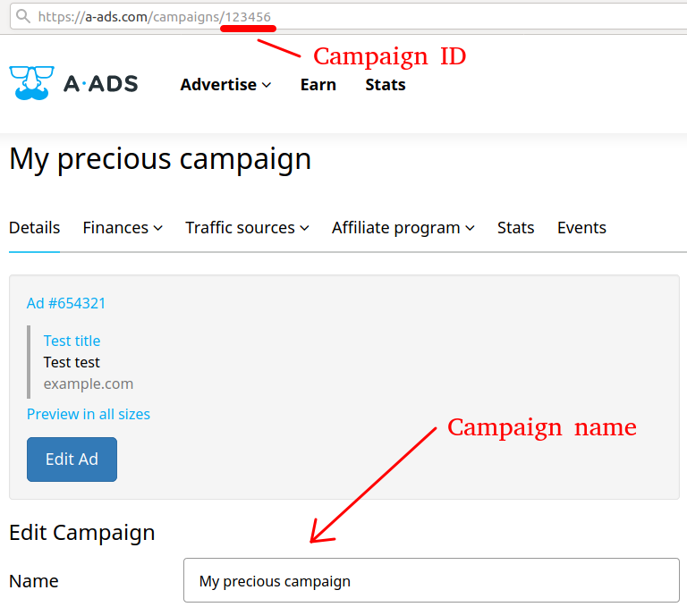
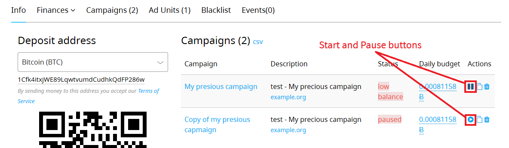
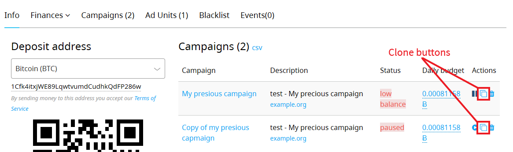

We've deployed new features for advertisers: you can now start, pause, clone, and rename your advertising campaigns.

## Naming campaigns

New campaigns have a default name of the form "Campaign #123456", where 123456 stands for a campaign ID. Now you can change it on the "Campaign -> Details" page. Campaign ID will still be present in the page URL.

## Start / Pause campaigns

You can start and pause a campaign on your user dashboard or a "Campaign -> Details" page.

## Clone campaigns

Now you can clone your campaigns using the "Clone" button from your user dashboard.

It will create a new campaign with the name "Copy of \[original campaign name]", which you can change.

We hope that our advertisers will find these features useful!