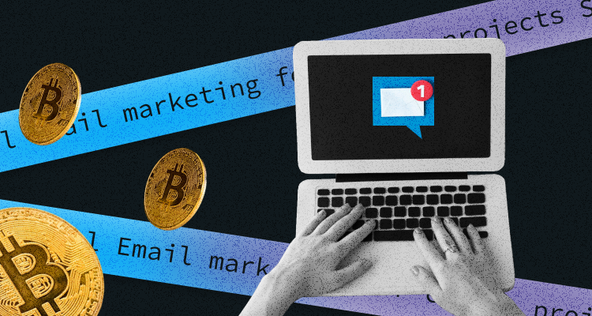
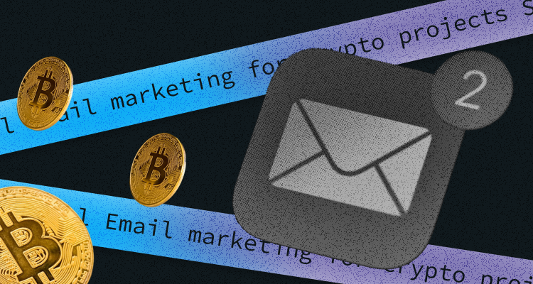

Nope, email marketing is not dead and feels better than ever before. One popular marketing tool for crypto projects is email marketing. This article will explain why this strategy is excellent for blockchain and crypto projects, showing some statistics and email examples. 

The one problem with email marketing for crypto projects is that some people may associate emails with spam. But if the emails are done well, it is one of the most effective marketing channels. 

To survive, a crypto startup needs excellent content, reviews, case studies, videos, podcasts, and articles on reputable crypto platforms, PR, and social media. 

## **Why Email Marketing?**

Let's have a look at some statistics:

* Emails are the most popular channel of communication of all. People send and receive more than 306 billion emails daily ([Statista](https://www.statista.com/statistics/456500/daily-number-of-e-mails-worldwide/), 2021)
* Email marketing revenue is estimated to be up to 11 billion by the end of 2023. ([Statista](https://www.statista.com/statistics/812060/email-marketing-revenue-worldwide/), 2021)
* 64% of small businesses and startups use email marketing to get new customers. ([Campaign Monitor](https://www.campaignmonitor.com/resources/guides/the-state-of-small-business-marketing/#one), 2021)
* The most effective strategies are subscriber segmentation (78%), message personalization (72%), and email automation campaigns (71%). ([HubSpot Blog Research](https://blog.hubspot.com/marketing/hubspot-blog-marketing-industry-trends-report?_ga=2.154607483.2116605659.1655405116-782004359.1655405116), 2021)
* The most effective email subject lines include promotional offers personalized to customers' interests. ([HubSpot Blog Research](https://blog.hubspot.com/marketing/hubspot-blog-marketing-industry-trends-report?_ga=2.134746674.2116605659.1655405116-782004359.1655405116), 2021)

### **What Devices Do Users Use To Read Emails?** 

Statistics show that 46% of smartphone users prefer to receive communications from businesses via email. ([Statista](https://www.statista.com/statistics/1263298/business-messaging-channels-preferred-by-smartphone-users-worldwide/), 2021)

### **How Often Do Users Open The Emails?**

99% of email users check their inbox daily, with some checking 20 times daily. 58% of consumers check their email first thing in the morning ([OptinMonster](https://optinmonster.com/is-email-marketing-dead-heres-what-the-statistics-show/), 2020), while 84.3% of consumers say they check their emails at least once a day. ([Pathwire](https://www.pathwire.com/research/email-engagement-2021), 2021)

### **What Are The Benefits Of Email Marketing For Crypto Projects?** 

1. **It is your own channel of communication** 

Social media accounts can be blocked within seconds, while email is an open communication channel that social media doesn't own. 

2. **You can choose the format you like** 

With email, a crypto startup can send content in a format that is convenient for them, such as text, graphics, videos, or GIFs. 

3. **Not everyone is on social media or platforms like Discord or Slack**

But most likely, every person uses email. 

**4.  Email marketing targets personally** 

With email, you have your reader's undivided attention. When customers have given you their email addresses, they are usually aware of your brand and more ready to take action or buy something.

### **How To Start Your Email Campaign?** 

Consider doing the following: 

* Create a strategy 
* Choose a mail provider
* Develop a sequence of emails and choose the frequency of sending
* Differentiate them by the target audience and levels of engagement 
* Collect data and statistics based on different metrics to improve communication and target your audience better.

You need to develop exciting ways to get prospective customers to part with their emails so you can grow your audience.

### **Crypto Email Marketing Campaign Strategy Specifics**

Now that we have looked at some general things, let's dive into more specific details that make email marketing so valuable for crypto business: 

* **Email marketing can help with the complexity**

May crypto or blockchain projects require a certain amount of background knowledge from the reader. Using emails, you can explain things as clearly and concisely as possible using various visual tools. 

* **Emails help to foster loyalty** 

Building a solid community around your project is the key to success, but you must ensure you engage the right audience. The wrong type of followers attaching themselves to your brand could harm getting good prospective users. Blockchain and crypto projects that communicate well can combine fun info and images, interesting announcements, links to educational blogs and videos, and other professional updates—these help build a community.

* **Spam filter dangers**

One big obstacle your email campaign can face is spam filters; email services don't know you or your project and can therefore employ filters that are unfair to legitimate cryptocurrency projects. This adds another layer of complexity to your work, as you must explain your project well and sell it convincingly while ensuring your emails get appropriately delivered.

* **Educate your readers** 

Crypto is a new industry that is constantly changing, so the literacy level in this area is pretty low. Creating applicable educational content may take a lot of effort, but this strategy pays out in the long run. 

### What Can You Do To Ensure Your Strategy Works?

* **Create valuable content**

Valuable content builds the trust that is especially important to projects operating in the crypto sphere. A good email marketing content strategy works wonders, providing your audience with interesting information that they can really use. The more knowledge the reader gets from you, the greater your authority will grow for them.

Helpful content can include market research, industry insights, comparison articles, or newsletters leading.

* **Optimized CTAs**

Ensure your email marketing calls to action (CTAs) are part of an accurately built marketing funnel. Different CTAs must be included depending on the audience and stage of their marketing funnel.

* **Use audience segmentation and email customization**

Use tools to differentiate our emails based on the interests of different groups and their marketing funnel stages.

To this end, you can build a drip campaign, setting up email automation that begins when your lead has just become a subscriber. You can examine a subscriber's website journey to decide which content to send first. If they visit high-intent pages like specific landing and pricing pages, this can automatically trigger emails with things like trial offers or incentivization programs.

* **Use email tools** 

Check the tools that your email provider offers. For example, some email software supports A/B testing. You can also test images, text structure, and CTA buttons to improve the click-through rate. You can also check your analytics software to find the right time to send emails. Some email software can also offer predictions on the best time to send based on algorithms.

* **Choose the best email marketing software platforms**

Check the best email marketing platforms to choose the one that suits you best. One of the most popular are:

* [Campaigner](https://www.campaigner.com)
* [Sendinblue](https://www.sendinblue.com)
* [Omnisend](https://www.omnisend.com)
* [GetResponse](https://www.getresponse.com)
* [EmailOctopus](https://emailoctopus.com)

### Email Marketing Types With Examples

1. **Welcome email** 

A welcome email is a great way to start your journey with a new customer. This is the first email subscribers receive after signing up to be on a list. Statistically, 8 out of 10 people will open a welcome email ([GetResponse](https://www.getresponse.com/resources/reports/email-marketing-benchmarks#location-industry), 2020). 

2. **Onboarding emails** 

These emails aim to educate subscribers about how to use a product effectively. The instructions should be clear, detailed, and easy to follow. 

The aim should be to get users' results and feedback after using the product, so they stick and spread the word to their family and friends. 

3. **Information about features and updates**

This type of email tells about the product features, informs them how it will benefit them, and how to use it. 

The user may discover a feature that will make them stick to the platform or upgrade their plan. 

4. **Newsletters** 

Newsletters are a perfect way to inform an audience. You can use newsletters to educate and entertain users. By choosing topics the readers want to know more about, a crypto company can have an audience looking forward to their newsletters.

If you link the blog or website in the newsletters, it will help you to increase your web traffic. 

5. **Referral email** 

This type of email helps a crypto project incentivize its existing customers to introduce their family, friends, or people they know. Generally, people are more likely to buy something when referred by a trusted friend. 

### Five Takeaways From Email Marketing:

1. Choose a crypto-friendly email service provider.
2. Place a subscription form on the project landing page.
3. Segment your mailing list based on the users' language.
4. Develop a corporate template and create a welcome email flow.
5. Create valuable and educational content.