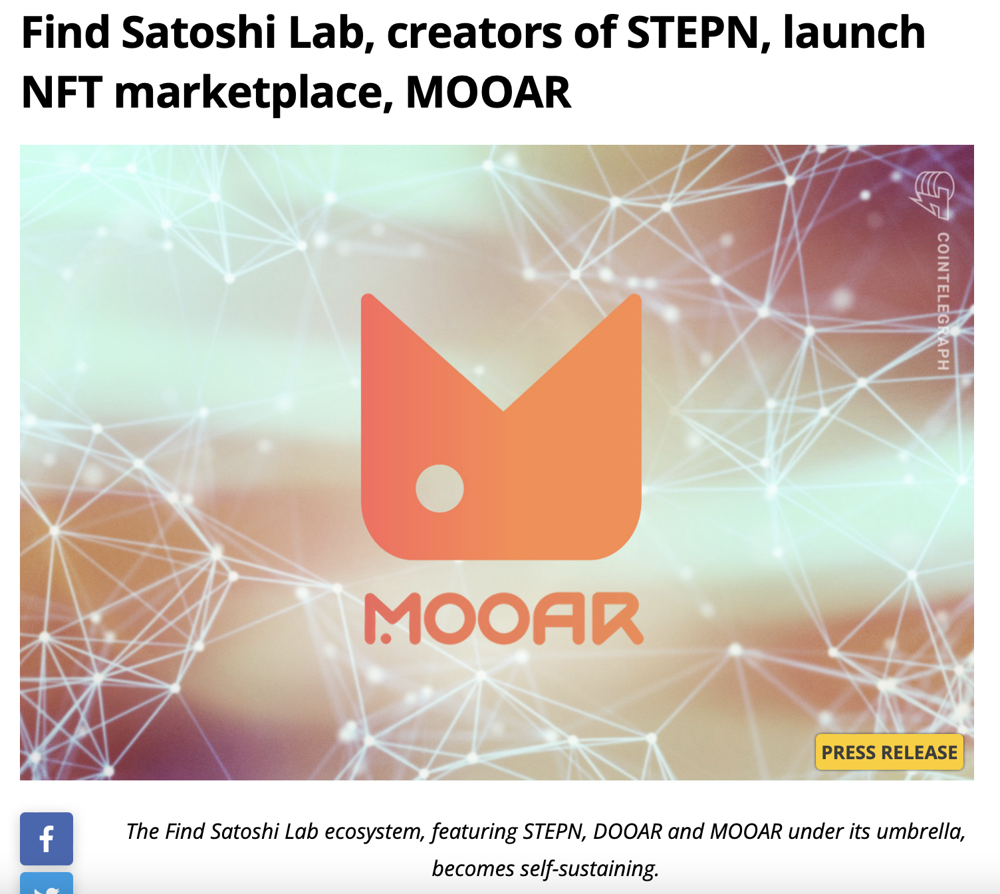

Crypto companies often need to pay more attention to writing press releases, which is a mistake! Both traditional and crypto media news portals are incredibly thankful for anything newsworthy from the blockchain industry. So, it's worth it for blockchain startups and established companies to bank on press releases as part of crypto PR services.

### What can a Press Release include? 

Many things, actually, such as: 

* Company launching 
* New product or service launching 
* Publishing research findings
* New team members 
* Industry insights
* Upcoming event or a conference participation 

Writing a PR message is easy. Just follow some golden rules: 

1. **PR shouldn't be too short** 

Your PR should be a substantial piece of writing rather than an empty description. Consider your brand's tone of voice when writing it, and avoid cliches. Vice versa, make it look like a solid piece of writing. 

2. **Develop your hook or your angle**

It means you must explain why it is important for the people reading it. It could be that your blockchain product solves a common problem, addresses a clear need, or opens up a gap in the market. 

3. **Use data and visuals to support your information**

Provide links to reliable sources that support your claims, such as industry or governmental reports.

4. **Include social proof**

People generally like success stories. Show or explain where you and your company are credible and should be taken seriously. If your company is a fresh new startup, mention the founders, their career tracks, and why they have decided to set up a business. 

5. **Still, keep it short**

No need to write a lot. The most important thing is to keep your PR as informative as possible. 

6. **Use a multichannel approach** 

The more places you can publish your PR, the bigger audience you reach. 

You can send your PR directly to journalists and influencers, who may publish it or write it up in an article. Or you can submit it to press release distribution services and platforms.

## How to lay out a crypto press release

Now let's look closer at the PR structure: 

1. First of all, put your Company Logo
2. Headline

The headline is usually the most attention-grabbing aspect of your Crypto PR efforts. Experts recommend a 65 to 80-character range for your headlines.

Avoid superlatives like "absolutely" and "amazing," and keep your headlines as short and straightforward as possible. 

3. Subheadline 

The subheading supports the headline, and it shouldn't be long. 

For example, The headline is "Find Satoshi Lab, creators of STEPN, launch NFT marketplace, MOOAR." In contrast, the subheadline is "The Find Satoshi Lab ecosystem, featuring STEPN, DOOAR, and MOOAR under its umbrella becomes self-sustaining."

4. Date and location 
5. 1st paragraph 

State the facts as concisely as possible. Tell about who you are, what you do, when, where, and why. Let's have a look at the MOOAR press release again: 

*Source: Cointelegraph.com*

6. 2nd paragraph

In the body of your PR, expand on the information provided at the beginning. Add more details, specifics, and technicalities here.

*Source: Cointelegraph.com*

7. 3-4th paragraph 

You can add social proof and some storytelling to make your PR vivid and engaging. 

*Source: Cointelegraph.com*

8. Boilerplate 

This part should include some description of your company, its main achievements, and other important information about the organization.

*Source: Cointelegraph.com*

9. Contact details 

Add contact details at the end of your PR, including name, email, and phone number.

*Source: Cointelegraph.com*

What to do next?

You can send your PR directly to journalists and influencers, who may publish it or write it up in an article. Or you can submit it to press release distribution services and platforms, which you can check here.  

Important takeaway:

Your press releases need to be carefully fact-checked. Any statement you make in your crypto PR must be complete and accurate. It is crucial for a project's reputation.