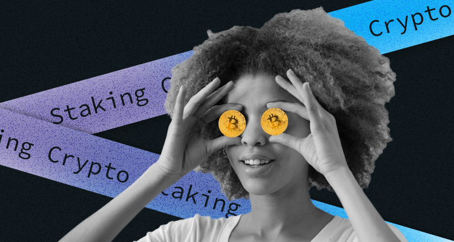

## What is staking crypto?

I bet you have heard about staking crypto a zillion times. But what precisely does staking crypto mean, and how can you benefit from it? Let's learn more about staking crypto and the opportunities it opens.

We know two ways of getting crypto: mining it and purchasing it. But, there is the third one left, and this is crypto-staking, or staking coins, as it's often called—is another viable alternative for the crypto-curious to get some assets in their crypto wallets.

"Staking" may be a relatively new addition to the financial lexicon. However, it's still essential for those interested in crypto-investing to understand what it is, how it works, and how you can benefit from it. So, let's explore the world of crypto staking and what rewards you can get!

### How does staking crypto work? 

First of all, staking crypto may sound like rocket science; yet it's just another step beyond simply learning how to buy bitcoins or how crypto exchanges work. Learning about cryptocurrency staking can broaden your knowledge and make you a more informed investor. 

In a nutshell, staking is how many cryptocurrencies verify their transactions, allowing crypto-investors to earn rewards on their holdings. This process involves committing your crypto assets to support a blockchain network and confirm transactions. But I must warn you that you can do so only with cryptocurrencies that use the proof-of-stake model to process payments.  

To go further, I'd like to mention a nice thing about crypto-staking: it can be a good way of generating passive income! First of all, some cryptocurrencies offer high-interest rates for staking. Cool, right?

Now let's get to the basics of all this stuff. Staking is part of certain crypto coins' processes to verify transactions. It's all part and parcel of a consensus mechanism called the "proof of stake." The blocks of transactions are added to a blockchain, a lasting string of transactions' "blocks" by people who already hold a particular stake in that blockchain's native currency.

Somehow the process is similar to the mining one when adding blocks to the blockchain of proof-of-work blockchains such as Bitcoins, for example. But, there is still a difference between these two processes. To gain the right to create a block, instead of racing to be the first to complete complex mathematical problems like miners do, in the proof-of-stake system, nodes (computers that participate in building the blockchain) do so by setting aside (or "staking") a certain amount of their holdings.

If you have some proof-of-stake crypto, you have the chance to earn coins in exchange for your stake, with the specific amount depending on the currency you have at hand and just how you stake your coins.

Plus, I want to add that there are heaps of ways you can get involved with staking coins that are much easier than setting up as a validator yourself. These include staking on a cryptocurrency exchange or joining a staking pool. We will touch on these ways later in the article. For now on, let's check out the algorithm for staking crypto.

### Staking on a cryptocurrency exchange

Now that you are ready to stake your crypto, let's check what further steps you need to take.

When you do staking via a cryptocurrency exchange, you make your crypto available via an exchange for use in the proof-of-stake process. It enables holders to monetize their crypto holdings that would otherwise lie unproductive in their crypto wallets. In this approach, the exchange does much of the administrative work for you, seeking out a node to join so you don't have to do it yourself. Here is an important one to say, it's not entirely risk-free. You still have to risk entrusting your coins to the exchange and node in question. Ok, I warned you, let's move further. 

### How to join a staking pool

I have already told you that a staking pool enables users to earn block rewards by sharing their resources, similar to a mining pool. Users get their tips divided between the pool operator and pool delegators, but some pools also charge entry and membership fees. These pools tend to follow a two-tier system, with an administrator overseeing the work of the validators and ensuring things run smoothly.

Investors must decide where and what they want to stake to start crypto-staking. Here are five simple steps to begin with. 

**Step 1: Choose crypto to stake**

The first step is deciding which coin you want to stake, so buy the cryptocurrency you wish to.

**Step 2: Know the requirements**

ETH, for example, needs a minimum of 32 ETH (worth about $47,000 at the time of writing) for users to begin staking. To become a staker on Tezos, you must hold 8,000 XTZ coins and run a full node.

**Step 3: Choose the desired coin**

The third step is to choose and download a crypto wallet in which you would store your coins for staking. You can go directly to the specific crypto's main website and download its wallet.

**Step 4: Choose hardware** 

One crucial thing in staking is a constant, uninterrupted internet connection. If you don't have it, forget about crypto staking. A standard desktop computer will likely be ok, although a Raspberry Pi might save on electrical costs.

**Step 5: Begin staking**

Finally, when you have chosen the software and downloaded the wallet you need, you are ready to start staking crypto. Congrats!

Now, let's have a look at the most popular crypto-staking coins. 

### Popular Crypto Staking Coins 

As I have told you before, not all cryptocurrencies offer to stake. It would be best if you had a cryptocurrency that validates transactions with proof of stake. Below are several of the significant cryptocurrencies you can stake in:

* Ethereum (ETH) was the first cryptocurrency with a programmable blockchain that developers could use to create apps. Ethereum started using proof of work, but it's transitioning to a proof-of-stake model. Users need at least 32 ETH to stake to run a validator node. While its hardware requirements are not nearly as high as those in Bitcoin mining, you'll need a fast computer with ample storage space connected to the Internet 24/7.
* Cardano (ADA) is an eco-friendly cryptocurrency. It was founded on peer-reviewed research and developed through evidence-based methods.
* Polkadot (DOT) is a protocol that allows different blockchains to connect and work with one another. Because, unlike other protocols, Polkadot pays out its validator pools for their equal work, not in proportion to the size of their stake. Polkadot rewards are generally paid out equally among stakers.
* Solana (SOL) is a blockchain designed for scalability since it offers fast transactions with low fees.

### What is the risk of staking crypto?

Again, one crucial thing I want to tell you is that staking is risky. It may not be as dangerous as diving into the Mariana Trench, but it isn't a risk-free exercise. Let me recollect some risks that you can face when staking crypto:

The value of your staked crypto may change. Cryptocurrencies are often highly volatile; your assets could drop in value with little warning, making it a much less profitable endeavour. Plus, if your staked assets suffer a significant price drop, that could outweigh any interest you earn on them.

Some proof-of-stake cryptocurrencies have lock-up periods, which means you can use your crypto within a specific time. And if you need money asap, you can't get it.

When you want to unstake your crypto, there may be an unstaking period of seven days or longer.

Another risk is the possibility of hacking/cyber attacks on the protocol or exchange. This is why some crypto investors prefer to stake in hardware wallets.

Now, when you know all the pitfalls, let's explore the best crypto-staking platforms.

### Best crypto staking platforms

Staking-as-a-service platforms are not the same as crypto exchanges and wallets simply ‘cuz they are dedicated to staking only. But, these platforms take a percentage of the rewards earned. Staking on these platforms is also known as soft staking.

**Crypto.com**

Crypto.com is available as mobile apps, and the staking and rewards programs vary depending on which app you use. Its main Crypto.com app works with more than 50 cryptocurrencies. The returns may vary based on lock-up periods, but the platform says they can be as high as 12.5%. 

**Kraken**

One more large and popular platform is Kraken. Kraken's staking rewards are available for over a dozen cryptocurrencies; some exceed 23% per year, which is tops among many platforms. The service also gets high marks for the liquidity it offers. There's no time limit to stake your cryptocurrency to earn rewards, though you make more the longer you stake. Rewards are distributed either once or twice a week, depending on the cryptocurrency you have used.

**Gemini**

Gemini has over 40 cryptocurrencies with rewards available. Although it does not advertise its offering as a traditional staking program, its "earn" features pay out interest on specific cryptocurrencies. Rates range as high as 8.05% APY. Rewards are distributed daily, which is good. Gemini has some limits on liquidity; users can request the return of their cryptocurrencies anytime but may wait up to five business days to receive them. 

**Coinbase**

Unlike other platforms on our list, Coinbase has a limited selection of coins that are eligible for staking and rewards on its leading platform. But, users of the Coinbase wallet service (which allows users to keep crypto in their custody) have some additional options. Rewards payout rates depend on the cryptocurrency you're staking, ranging from daily to quarterly. Five assets are available on the leading platform, with rewards of up to 5%. Twenty-six assets are available on the wallet service, with rewards approaching the 15% range.

**FTX**

FTX has a pretty simple program available on its mobile application. If you like the program, you can get up to 8% APY on whatever you hold on the platform. The rewards rate drops to 5% for any amount you own more than $10,000. You can withdraw or spend assets any time, and the rewards are calculated hourly. FTX has 21 cryptos on its app.

**TradeStation**

We generally know TradeStation as a platform for trading stocks, but it is also a cryptocurrency platform. It also offers a lending program that pays interest on cryptocurrency. TradeStation's selection is relatively small, with only five cryptocurrencies eligible for rewards up to 5% per year, but it offers liquidity to participants that rivals any of its competitors. Digital assets earning interest can be traded similarly to those not earning interest. Rewards are distributed monthly.

About the hardware wallet that I mentioned above. As of March 2022, here are two of the top hardware wallets with the highest staking rewards:

Ledger: 6% for XTZ, 7% for TRX, 8-10% for ATOM, 5-6% for ALGO, and 10% for DOT (yields are an estimate and have not taken into account validator's fees or commissions)

Trezor: Trezor wallet does not support direct staking on its UI. However, you can connect to wallet apps like Exodus. Yields are 8.98% for ATOM, 4.91% for ADA, 5.46% for XTZ, and more.

### Conclusion 

To sum up, staking is economically and environmentally healthier than PoW-based mining. Staking is also one option to earn passive income, especially if you are a long-term investor. 

But still, don't forget that crypto-staking comes with some risks; therefore, it is essential to do thorough research and invest wisely.

Happy staking, and have a fantastic day!