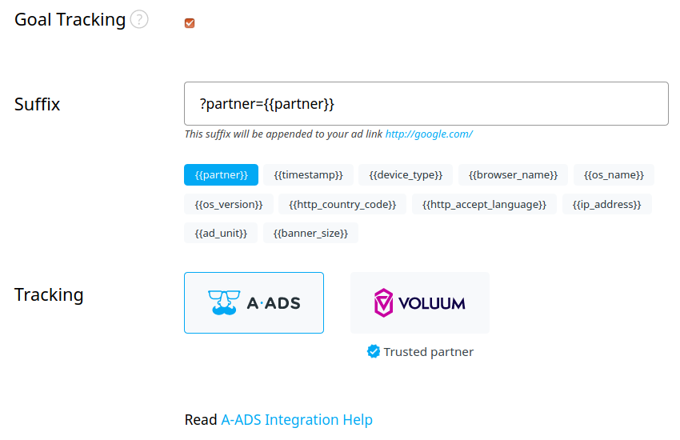

## Why goal tracking?

If you advertise your product with A-ADS, you probably want to know more about the traffic you receive.

With the "Goal tracking" option enabled, you can use your web analytics system to learn about the traffic sources and optimize your campaign.

**Nota bene:** to access the information you'll need some outer tracking engine, e.g. Google Analytics, Voluum, AdsBridge, Peerclick, or any other.  A-ADS goal tracking only provides the info, but you won't see it on our site.

## How to configure goal tracking?

You can enable goal tracking by checking the corresponding field on the campaign page:

You will see the suffix applied to your campaign, e. g. "?partner={{partner}}".

Each time we serve your ad, our server will append this suffix to your ad link and replace the "{{partner}}" with some tracking value, which identifies your campaign and the traffic source.

If your ad link is `https://example.org` and the suffix "?partner={{partner}}", then visitors may come to your site via the link `https://example.org/?partner=12345_67890`, where "12345" is your campaign id and "67890" is the ad unit id.\
Full info on all tokens [here](https://a-ads.com/blog/2021-03-15-a-ads-tracking-tokens-and-their-output/).

## How to adjust the suffix?

Sometimes you might need to adjust your suffix to make it work properly.

E. g., if there is already the "?" symbol in your ad link, you might want to remove it from suffix or replace it with an ampersand.

You can also rename the "partner" parameter in your suffix to something else. The only thing you must keep is the "{{partner}}" macros as it stays for the dynamically changed tracking value.

## So how do I optimize my campaign?

The "Goal tracking" option lets your web analytics system collect the ids of the ad units that send visitors to your site.

Using these ids, you can exclude the bad ad units from your campaign and concentrate your advertising budget on the good ones.

You can also reward good traffic sources and receive more traffic from them. Our helpdesk will help you with this.