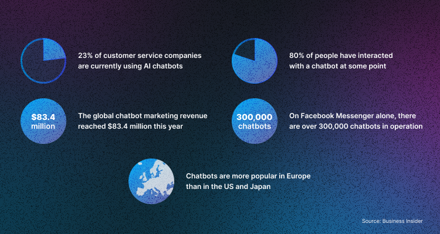
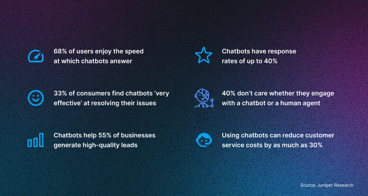

More and more companies are switching to remote work as we see an increased demand for process automation. Today even large companies, from marketplaces to taxi/delivery aggregators, use messengers in the sales funnel. 

In this article, we will explain what chatbots are and what they are used for in crypto businesses and look at some statistics and chatbots' benefits. 

In Part 2, we will look at successful business cases with chatbots and marketing strategies you can implement into your crypto business. 

## What Are Chatbots?

Chatbots are an excellent tool for automating marketing processes. From simple customer service bots, they differ in efficiency: instead of passive communication, they can initiate a dialogue, recommend relevant products at the right time, talk about new promotions/discounts, or reactivate "sleeping" customers. At the same time, chatbots do not need the support of a live operator-consultant, at least at the first stage of the funnel.

Marketing chatbots are usually designed to respond to specific triggers and initiate conversations when the customer is ready to interact. It allows discussions to be more natural and more like regular consultants.

## How Can Chatbots Help Businesses?

Chatbots help businesses with the following tasks: 

* **Share news and updates**

When people start interacting with your brand, you can invite them to sign up for periodic newsletters from your company. Thus, you can regularly report on new arrivals, discounts, and promotions and keep in touch with the audience.

* **Provide technical support**

The chatbot can be configured to answer FAQs. Since the chatbot operates 24/7, you can offload the technical support team and avoid hiring many employees to work two shifts.

* **Place orders**

You can automate order-taking with a chatbot if you own an online store. If the user is not yet ready to buy, the chatbot can identify the client's interests and redirect him to the manager.

* **Allow buyers to track the package**

Chabots can be configured in such a way that it informs customers about the package number and the status of its delivery.

* **Make appointments with clients**

A chatbot is indispensable for start-up companies where all functions lie with one or more people. You can connect the chatbot to Google Calendar and automate the booking process so that you can spend more time working where your presence is indispensable.

In the survey below, you can see what business owners use chatbots for:

## What are chatbots' advantages?

Chatbot marketing provides brands with some great benefits, such as:

* **Chatbots help save time and money**

They allow a crypto company to serve more customers with less effort and money. Compared with human employees, a chatbot is a one-time investment of time and money that works autonomously.

* **They provide customers with quick responses**

The instant response allows users to resolve issues quickly, resulting in a positive experience with your brand. This helps create a good impression of your company and instil confidence in potential customers.

* **Chatbots increase engagement**

Communication with chatbots occurs in Facebook Messenger, WhatsApp, Telegram, and others, with many users. With this communication channel, you will be able to engage your target audience worldwide.

* **They attract more leads**

Use a chatbot in your marketing strategy to quickly move leads down the sales funnel. With the help of short answers, you can understand what the customer is interested in, their tastes, and preferences.

* **Provide data for analysis**

User data obtained through a chatbot provides valuable insights into their needs and desires. This will optimise your chatbot and improve the quality of communication.

* **And finally, chatbots help to segment traffic**

The chatbot communicates with customers in different directions, which allows brands to segment them into groups based on common interests.

In addition to all the benefits, a study by Statista [showed](https://www.statista.com/statistics/717098/worldwide-customer-chatbot-acceptance-by-industry/) that 34% of users prefer to interact in online stores with smart bots rather than with people. The reason is simple, chatbots respond faster and more accurately to their requests. 

In Part 2 of this article, we will delve into the most effective chatbot marketing strategies and analyze successful case studies that have benefited businesses. Stay with us.