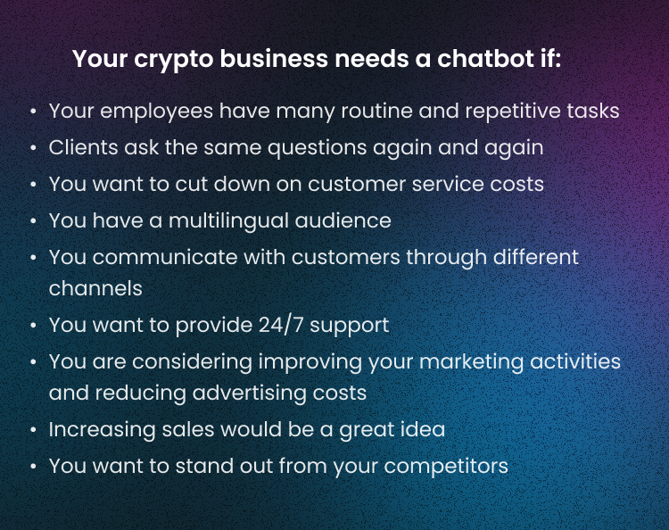
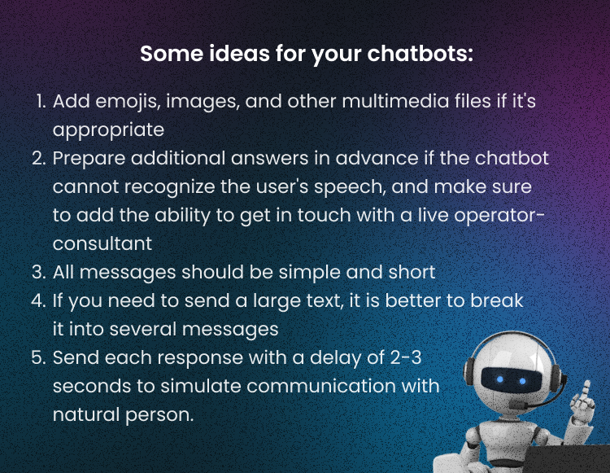

In our previous article about chatbots[ here](https://a-ads.com/blog/why-you-need-chatbots-for-your-crypto-business-part-1/), we have written about the pros and possible cons. In the second part of the article, we will tell you in detail what steps you should take to create your own chatbot for your business. We will also look at some great examples in the industry where chatbots have worked successfully. 

### **Does Your Crypto Business Need Chatbots?** 

If any of these factors are true for you, then your crypto business does need a chatbot: 

However, despite all apparent advantages, chatbots have their limitations, which may include the following: 

* **Serious preparation**

Before launching any chatbot, you need to analyze the customer's needs first, write their journey, and understand what questions and at what moments they have.

* **Chatbots can’t replace your employees**

Even if your chatbot’s work is well-thought, it will never cover 100% of requests. If an unusual situation arises, the client will still need the help of an operator.

* **Chatbots need constant updates**

You need to update the bot script if something changes in the client path. In addition, the underlying logic may not correspond to customers' real needs - you need to monitor their complaints and reactions.

Before talking about the steps you need to take to create your crypto chatbot, let’s look at four main principles.

## How To Make A Successful Chatbot: Four Principles

1. **Your chatbot must anticipate customer requests**

It means the bot does not wait for the client to ask a question but finds a solution asap based on the analysis of the stage of the life path. 

2. **A chatbot solves customer problems**

 The chatbot should offer a solution but not immediately address the problem to a support team. For example, if the ordered item is unavailable, the bot advises an alternative.

3. **The chatbot develops evolutionarily, going from simple to complex**

First, it must learn how to solve simple issues, such as informing about the status of an order. Then you can build up complex scenarios, but it is essential to remember that in non-standard situations, the client should be able to contact the operator within seconds.

4. **Chatbots should constantly improve their work**

It makes sense to continually analyze the reply speed, find weaknesses in the logic, and update the script when the client path changes. Otherwise, the chatbot will quickly become an outdated and useless tool.

Now, when you are ready to start your chatbot for your crypto business, you need to take ten steps to do it with flying colors. 

## 10 Steps To Create A Chatbot For Your Crypto Business

**Step 1. Set Targets**

Try to answer the following questions first:

* Why do you need a chatbot?
* What problems can a chatbot solve in your crypto business?
* How exactly will it solve them?

**Step 2. What Tasks Will You Delegate To Chatbots?**

Usually, chatbots are given repetitive tasks: the same type of customer service, technical support, sales by the funnel, audience segmentation, and so on. Plus, bots are also actively used for personnel management and the selection of primary candidates. You should carefully analyze the most time-consuming and routine tasks in your service or business at this stage.

**Step 3. Choose Language And Channels**

And again, start with the questions:

* What communication channels do you want to automate? (website, WhatsApp, Telegram, Instagram, or all at once)
* What languages ​​will the chatbot use?
* Is the number of customers in this channel who speak this language growing or decreasing?
* Are you planning to engage with users long-term?

**Step 4. Choose The Tools**

Step 4 is to list the necessary basic integrations for your chatbot. They can be a CRM, calendars, payment systems, cloud storage, or any other software you use in your company. Then, evaluate each tool according to the already familiar principles above.

**Step 5. Choose The Platform**

You can use a constructor website that specializes in it to build your chatbot or hire a development team. Both options are fine, but which one to choose depends on the chatbot’s type, your business needs, budget, and time.

Creating a chatbot for marketing, sales, and lead generation is faster and easier with the help of constructors or platforms. These systems already have all the necessary functionality and integration with many other solutions.

And if you need a complex bot with non-standard integrations, then go for the developers’ team. 

Some great platforms that can help you to create your chatbots are: 

* [Rave Chat](https://www.revechat.com/)
* [Many Chat ](https://manychat.com/)
* [Chatfuel](https://chatfuel.com/)
* [MobileMonkey](https://mobilemonkey.com/)
* [TARS Chatbot](https://hellotars.com/)
* [Yellow ](https://yellow.ai/)

**Step 6. Prepare The Requirements** 

In case you choose the developers' teams, you will need the following:

* Сlear KPIs
* Сritical milestones and outcomes discussion 
* Agreement on the cost and time 
* Discuss your participation at each stage of the work
* Discuss communication with the developers: how often you will call up, how you will correspond, how the progress of creating a chatbot will be tracked, and so on.

**Step 7. Create Chatbot Personalities**

One of the most creative steps in your journey! To create a chatbot's personality, determine its communication style and dialogue structure. For that, you need to know your audience well and ask questions about your users.

To think about the structure of the dialogues, start with a list of frequently asked questions the bot will answer. To do so, ask your customer service and sales team the questions they receive most often. Then, study calls and letters from your customers, look for the same type of requests in mail or messengers and check your company's communication scripts.

Plus, you can analyze your FAQ section, knowledge base, and documentation. 

Don’t forget about your social media.

**Step 8. Testing Time**

When your chatbot is ready, it’s time to test its work! The questions below will help you to understand if the mechanism works well: 

* Are chatbot’s messages functional and logical? Does the user understand its words correctly?
* Is it interesting to chat with them? Is the conversation structure built well? Does it use emojis, buttons, GIFs, images, and explicit language?
* How quickly does the chatbot respond?
* Does the bot recognize your requests and provide clear and valuable answers?
* What does the bot do when it does not understand the request? What does it answer? 
* Are there any dead-end dialogues? 

**Step 9. Analysis** 

After some time, analyze the work of your chatbot by looking at some product metrics. You will need the following:

* **Bounce rate:** Check how frequently and what questions the chatbot did not understand the user and gave answers like: "Try to rephrase your request."
* **Session Duration:** Calculate the average time spent in conversation with clients. If it turns out to be too short, it will likely mean the chatbot is useless.  
* **Premature conversation termination:** Learn how many users have terminated the interaction with the bot. Why?
* **Goal Achievement Rate:** How many customers got their questions answered? If your bot is focused on scheduling appointments or product sales, how many consumers could sign up/purchase the product they need?
* **Customer Satisfaction:** If you have a feedback feature implemented, check how many people rated the quality of your bot.

**Step 10. What To Do Next?**

Technology, like chatbots, develops quickly. It means you should constantly analyze and improve your chatbot.

At the initial stage, it is better to create a simple bot and then add new features to it per the requests and needs of your customers.

## Chatbot Examples

Some successful chatbot examples were created and implemented by well-known companies: 

1. **Adidas Women:** a chatbot that sends product updates 

This bot enables women to find the right products and helps them register within a conversational interface for users.

2. **[Sephora](https://www.chatbotguide.org/sephora-bot):** improves user experience with personalized recommendations

*Source: Sephora.com*

3. **Marriott Hotel:** Meets their customer requests effectively

Marriott's bots help guests request essential hotel services, acting as an in-phone concierge. It helps eliminate a middleman's involvement and enables requests to be met quickly and efficiently. 

4. **KLM Royal Dutch Airlines Bot:** This travel assistant is accessible 24×7, speaks multiple languages, provides real-time responses to travelers' queries, and is available on the FB Messenger app.