## Default error

So, you’ve got an error message saying that your ad unit code is not found. This error seriously reduces your earnings and needs to be fixed. 

If you see this message alone, this means that our bot cannot find the ad unit at the specified URL. 

An ad unit must be present on that very page you specified for it in the ad unit settings, as our bot doesn't search through all your site pages to find the ad unit, it checks only the specified page. So first of all, check if the ad unit is present right at the specified URL.

We often show one more info message below this one. It describes the exact reason why your ad unit is not found (even despite the ad unit code present at the specified URL). Here’re the most popular problems and possible fixes:

## Timeout error

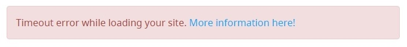

Your site takes too long to respond. 

## Unavailable site

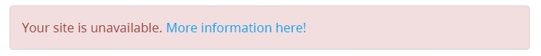

Your site cannot be loaded with a browser at all, e.g. it might be offline.

## Page cannot be loaded

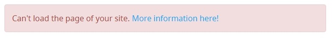

The error appears when a website can be opened in a browser, but its source code cannot be analyzed by our bot program because of incorrect site settings. The possible reasons are as follows:

* A site page keeps reloading
* A site has an endless page
* A site database is not configured
* A domain name is not registered
* A site forbids VPN, proxy, Tor, etc.

## Redirecting to another website

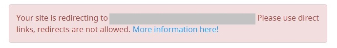

An ad unit must be present on the URL specified for it on the ad unit page. You get the “Redirecting to another website” error, if this URL redirects to some other domain. 

To fix the error you can either remove redirect, or change the URL of the ad unit on the ad unit page at a-ads.com. You can edit the ad unit URL via the link on the ad unit page:

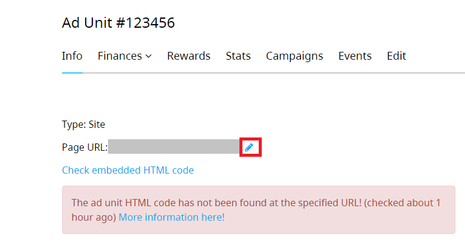

Mind, if your ad unit had been found on the old URL before, you won’t be able to change the URL yourself, you’ll need help from our support team to do it.

If you cannot fix the problem, just abandon this ad unit and create a new one. :)

## Missing URL

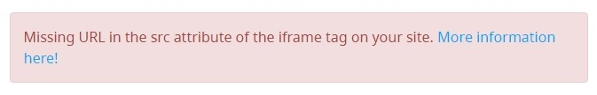

This error appears if src attribute of the iframe tag is absent or is empty. This can happen e.g. if you have edited your ad unit code and occasionally removed the src attribute. 

In case you add a URL into src attribute with JavaScript, it’s possible that it is not added in due time, so the bot will define the URL as empty.

A correct src attribute looks like this:

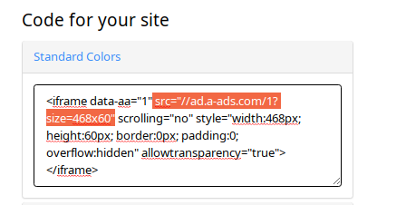

## Invalid URL

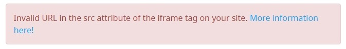

Attribute src should contain a normalized URL. If a URL is not normalized, you’ll get this error message. 

You can check if the URL is correct by copy-pasting it into browser address bar - a banner should be displayed. E.g. you copy this:

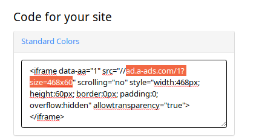

And see a banner:

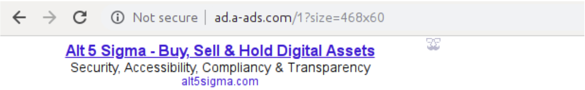

So, the URL in the src attribute is correct.

Here are examples of invalid URLs:

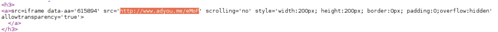

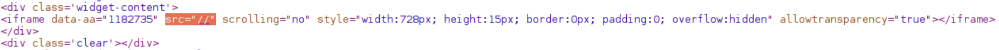

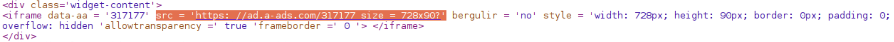

The last URL is also invalid, because it contains space symbols and an ad cannot be loaded for this reason.

## Alert or pop-up message is blocking your ad

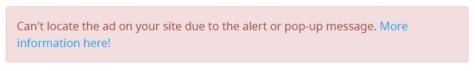

The bot normally can verify an ad unit in spite of alert, confirm and prompt windows on your site page. In cases when it cannot cope with this sort of pop-up, you get this error. 

Pop-ups blocking a banner might look like this:

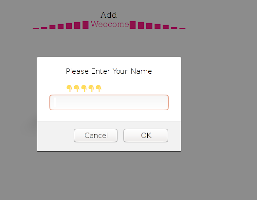

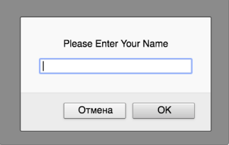

## Ad is not fully visible

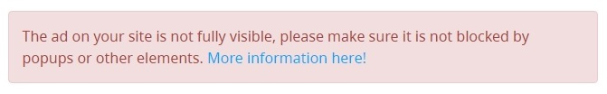

You get this message if an ad on your site is not fully visible. A banner is present in the site code, but is partly or fully hidden by some other page elements. If banners overlap each other, you’ll get this error too.

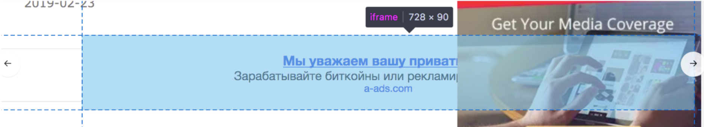

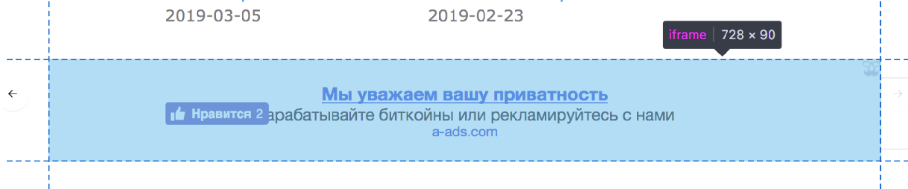

If you place a floating ad that can be closed, the “Close” button should not overlap it, else you’ll also get this error. Here is an example of proper placement of a button: 

And here is the wrong way: 

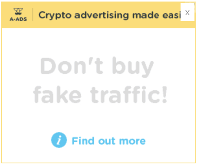

The "Ad is not fully visible" error might also be caused by a pop-up window that appears while loading a site. Prompt, alert, and confirm windows normally don't cause an error or cause another error. :)
If you can avoid pop-up ads, you'd better not use them. 

Another probable reason for the error is that your banners are loaded later than your site.

Suppose the ad unit on your site is placed correctly but doesn't appear immediately after loading. In that case, our bot may consider it invisible, blocked by another element, inaccessible for clicks, or undetected. Please get in touch with our support team in this case - we'll fix the error.

## Ad is unclickable

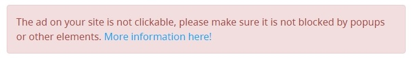

A banner must be clickable. A click must lead to the advertised site. If nothing happens after a click, or if it leads to some other site, the error appears.

## Invalid domain

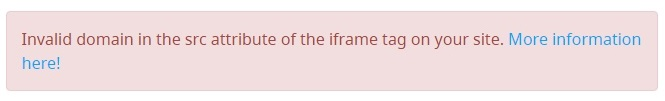

The src attribute must contain one of a-ads.com domains. On the moment two domains are allowed: ad.a-ads.com and acceptable.a-ads.com . If the src attribute contains any other domain, you’ll get this message.

## Empty data-aa

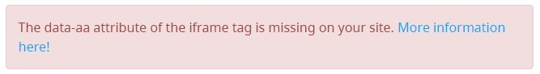

The error appears if there’s no data-aa attribute in the iframe. A correct iframe with data-aa attribute looks like this:

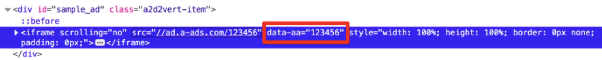

An erroneous iframe:

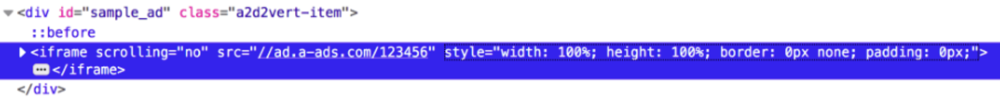

## Empty ID

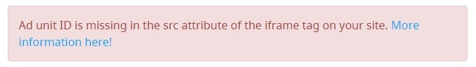

An ad unit ID must be present in the src attribute of the iframe tag in your site source code. The ID is expected to be after the first slash sign “/” following the domain (ad.a-ads.com or acceptable.a-ads.com). A correct code piece looks like:

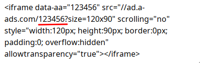

This one is incorrect, because an ID is absent in src attribute:

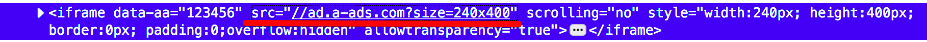

An ID is also expected to be before the next slash or further params, e.g. “?size=240x400”. That’s why ID is regarded empty in the following case as well:

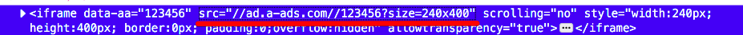

## Invalid ID

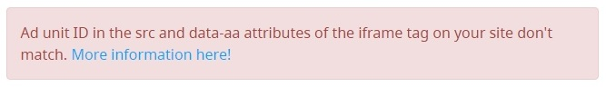

This error means you’ve got one ad unit ID in the src attribute and another ID in the data-aa attribute in the iframe tag embedded into your site source code.

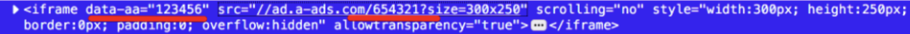

## Size doesn’t match

An ad unit can be adaptive or have a fixed size. 

The minimum allowed size for an adaptive ad unit is 120x25 px. If a banner on your site page is less, you’ll get an error message:

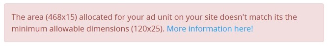

If your ad unit is a fixed size one, the banner on your site page should match ad unit exact size, else you’ll get an error message:

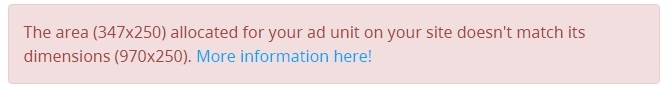

To fix the error, you should adjust an actual size of a banner with the requirements. The required size for your banner is present in the text of the error message (the second size of the two). The first size in the error message will be the actual size of a banner on your site.

## Cloudflare denies access

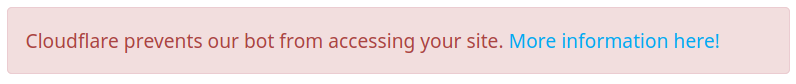

Cloudflare prevents our bot from accessing your site. To fix this, please whitelist our server IPs. You can address support to know the IPs to add.

## Unknown error

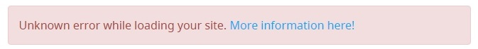

An unexpected error occurred, and we cannot identify its origin. It might disappear on its own or remain, so you should contact our helpdesk.

## Conclusion

If the issue is likely on your side, we encourage you to find the solution before you address the support. You can run our bot after you've fixed the issue to see if the error has disappeared.

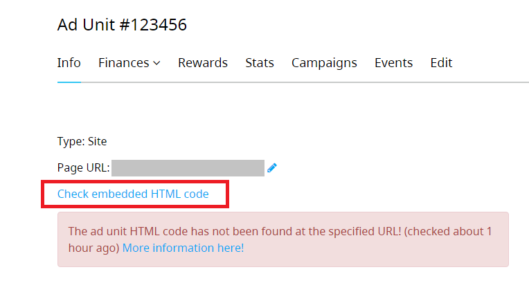

If an ad unit code is placed on your site by the specified requirements, and our bot still cannot find it, please, contact our support team, and we will eagerly help you.